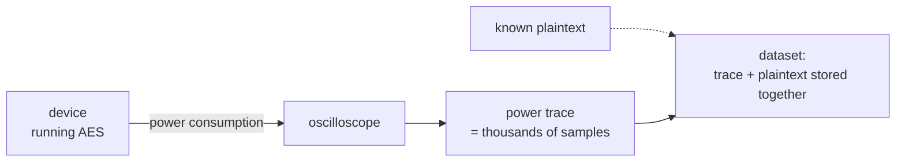

# Chapter 1 — Secrets that leak

## Cryptography in the real world

AES (Advanced Encryption Standard) is a widely used cipher. It takes 16 bytes
of input (the **plaintext**) and a secret 16-byte **key**, and produces 16
bytes of **ciphertext**. For example, with

```text
plaintext  = c549dd73446310a073b9f9c6bdc7e66d
key        = 175cf2997a8583413c77dfac7e6c59d8
```

AES-128 produces

```text
ciphertext = e70e50e7a0829e5f6691ac64dde13056
```

(This is not a made-up example: it is a real encryption taken from one of the
datasets we will use later. You can verify it with any AES calculator.)

AES is designed to be secure against classical analysis: if you don't know
the key, recovering it by examining plaintexts and ciphertexts is, for all
practical purposes, infeasible. That is the theory.

In the physical world, however, an algorithm runs on a **device** — a smart
card, a microcontroller, a chip. A device consumes **power**, emits
**electromagnetic radiation**, and takes a certain **amount of time** for each
operation. All of these physical quantities depend on the data being
processed — including the secret key.

An attack that exploits these unintentional physical emissions is called a
**side-channel attack**. The attacker does not need to break the mathematics
of AES: they only need to measure something the device *leaks*.

## What is a power trace?

Every time the device performs an encryption, we can record its power
consumption over time with an oscilloscope. That recording is a **power
trace** — a long list of numbers, one power measurement per time step.



Here is a real trace from one of our datasets — one full AES encryption,
recorded as 15,000 power measurements:


To the eye it looks like noise. But different intermediate values inside the
chip cause slightly different power consumption, and if we record **many**
traces together with their known plaintexts, statistics can find where those
differences hide. The attacker's task is to **find which time samples leak
information about the key**, then use that leakage to recover the key.

## Why deep learning — and what we are after

Classical side-channel analysis builds a statistical model of the leakage by
hand — for example, comparing traces against a hypothetical power model and
scoring key guesses. That requires a good understanding of *where* the
leakage is.

Deep learning instead **learns the leakage directly from the traces**: the
network is given raw traces and their labels, and it learns to map a trace to
the likely intermediate value. No expert feature selection is needed — the
network figures out which time samples are informative.

The cost is interpretability. A model that recovers the key confirms that
exploitable leakage exists, but not *how* the network exploits *what* leakage.
That is the question these chapters build toward. First we need the
intermediate value the leakage actually tracks.

← [Index](README.md) · Next: [Chapter 2 — Intermediate values](02_intermediate_values.md) →
