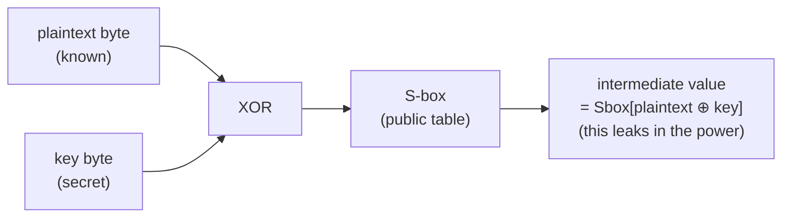

# Chapter 2 — From plaintext to intermediate value

[Chapter 1](01_secrets_that_leak.md) left the attacker with a power trace and a
known plaintext. The leakage is not related to the raw key bytes directly. It
is related to the *intermediate values* computed during the cipher.

AES works in rounds. In the first round each plaintext byte is combined with
one key byte and passed through a lookup table called the **S-box**:



The plaintext is known to the attacker; the key byte is what we want. Because
a byte has only 256 possible values, we can enumerate all candidates for the
key byte and check which one explains the observed power. Two common ways of
labelling the traces — *leakage models* — are:

- **Identity (ID):** the label is the full 8-bit S-box output (256 classes).
- **Hamming Weight (HW):** the label is the number of `1` bits in that output
  (9 classes), reflecting the fact that power consumption grows with the
  number of bits that flip inside the chip.

Concretely, for a known plaintext byte `p` and a candidate key byte `g`:

```text
ID label  = Sbox[p ⊕ g]           ∈ {0, 1, …, 255}
HW label  = popcount(Sbox[p ⊕ g]) ∈ {0, 1, …, 8}
```

For the first ASCADr attack trace used later in these chapters (`p = 0x8e`) and
the true key byte `g = 0x22`:

```text
ID label  = Sbox[0x8e ⊕ 0x22] = 145
HW label  = popcount(145)     = 3    (145 = 0b10010001)
```

Attacking therefore means relating the trace to one of these intermediate
labels — not to the key string itself. On unprotected devices that relation
can already be strong. On the devices we study it is not, because of
**masking**.

← Previous: [Chapter 1 — Secrets that leak](01_secrets_that_leak.md) · [Index](README.md) · Next: [Chapter 3 — Masking](03_masking.md) →
