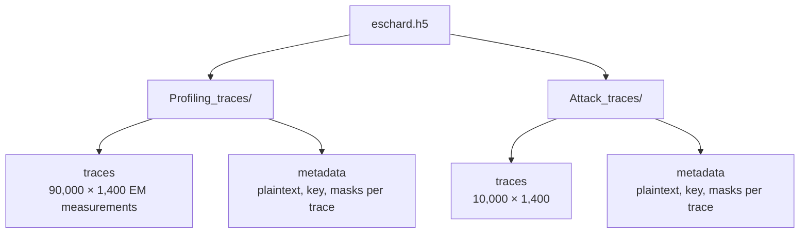
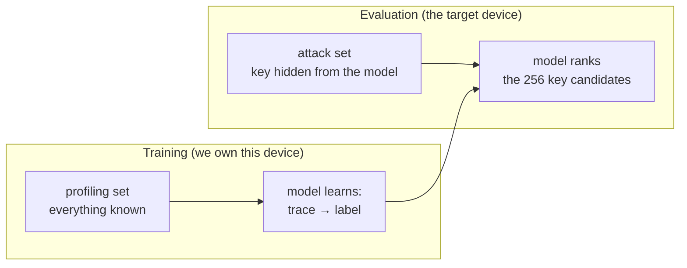
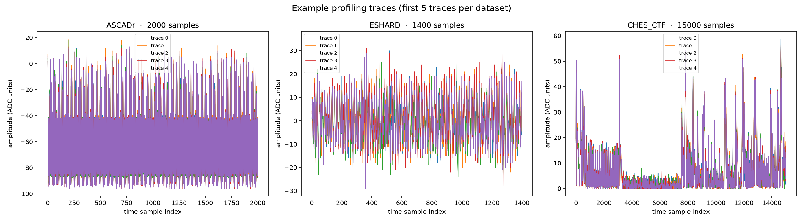
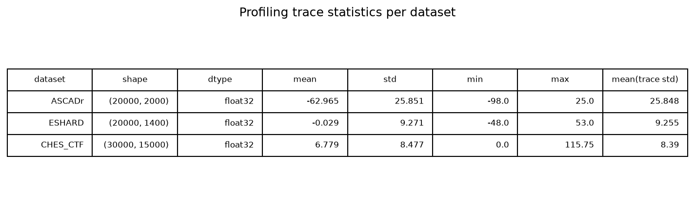
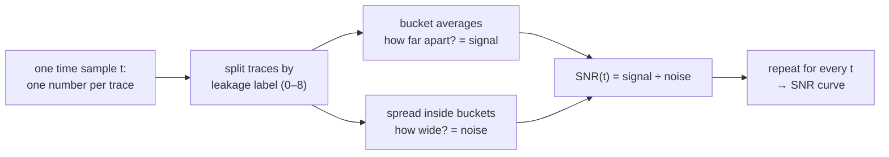
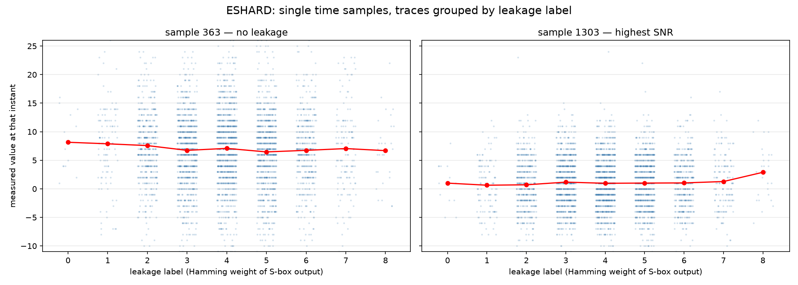
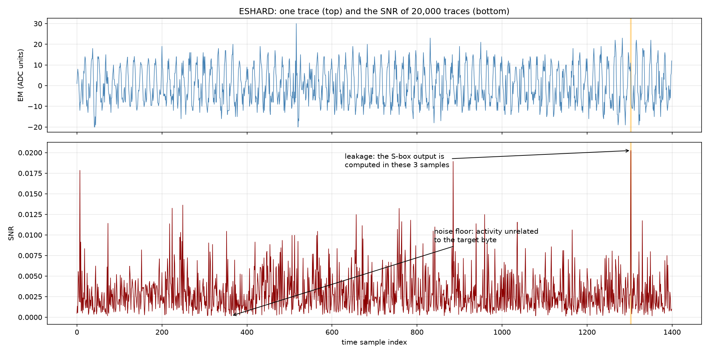
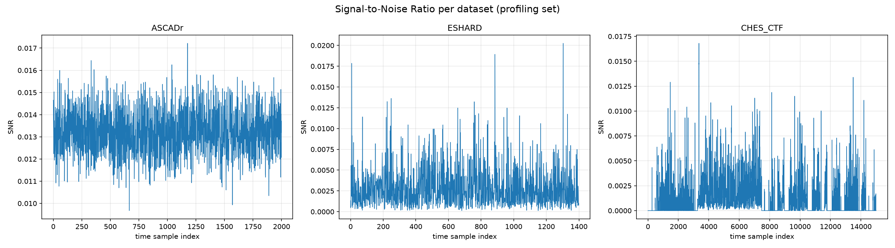

# Chapter 2 — The data

We work with three public datasets, each a collection of side-channel
measurements of AES-128. All three come from implementations protected with
**Boolean masking** (a countermeasure that randomizes the intermediate values
with random *masks*), and in all three the attack targets the first
encryption round. What changes is the device, the measured quantity, and the
trace length:

| Dataset | Device | Measured | Traces (profiling / attack) | Samples per trace |
|---------|--------|----------|------------------------------|-------------------|
| **ASCADr** | 8-bit AVR microcontroller (ATMega8515) | electromagnetic emissions | 200,000 / 10,000 | 2,000 |
| **ESHARD** | 32-bit ARM Cortex-M4 | electromagnetic emissions | 90,000 / 10,000 | 1,400 |
| **CHES_CTF** | 32-bit ARM Cortex-M4 | power consumption | 30,000 / 10,000 | 15,000 |

## Where do the datasets come from?

All three are public benchmarks from the side-channel research community:

- **ASCADr** — the variable-key variant of **ASCAD** (*ANSSI SCA Database*),
  released by ANSSI, the French cybersecurity agency, as a benchmark for
  deep-learning side-channel research
  ([github.com/ANSSI-FR/ASCAD](https://github.com/ANSSI-FR/ASCAD)).
- **ESHARD** — the trimmed public version of the **ESHARD-AES128** dataset:
  electromagnetic measurements of a masked, shuffled AES-128; the trim keeps
  the first round without shuffling.
- **CHES_CTF** — traces released for the **Capture-the-Flag competition of the
  CHES 2018 conference** (Cryptographic Hardware and Embedded Systems), the
  main academic venue of the field.

The raw measurements are far too large to work with directly (hundreds of
thousands of samples per trace), so the paper uses trimmed and resampled
windows around the first AES round — that is what our files contain. Full
details, including download links: [docs/appendix_datasets.md](appendix_datasets.md).

## What is inside each file?

Each dataset is a single **`.h5` file** — an *HDF5* file. HDF5 is a container
format for large numerical arrays, organized like a filesystem: *groups*
(folders) holding *datasets* (arrays). You cannot read it in a text editor;
you open it with a library such as `h5py`:



The `metadata` array is our ground truth. Each record holds the cryptographic
values that produced the trace in the same row. With `plaintext` and `key` we
can compute the leakage label of every trace (see the leakage models of
[Chapter 1](01_introduction.md)):

```python
label = sbox[plaintext[byte] ^ key[byte]]              # identity model
hw    = popcount(sbox[plaintext[byte] ^ key[byte]])    # Hamming weight model
```

## Profiling vs attack: a critical split

Every dataset is divided into two disjoint sets:

- **Profiling set**: traces where *everything* is known (plaintext, key,
  masks). Used to **train** the model — the deep learning equivalent of
  "profiling the device".
- **Attack set**: traces where the key is *known to the evaluator* but treated
  as *unknown to the attacker*. Used to **test** whether the trained model can
  actually recover the key from fresh measurements.



This mirrors real life: an attacker first trains a model on a device they own,
then uses that same model against a target device of the same type.

## A first look

Before training anything, three things are worth seeing. Each figure below is
generated step by step in the companion notebook; here is the summary.

**Trace shapes.** Traces from the three datasets look nothing alike — compare
the short traces of ESHARD with the long, spiky traces of CHES_CTF. The main
reason is the physical measurement itself: ESHARD and ASCADr record the
electromagnetic emanations of the chip with a probe placed near its surface,
while CHES_CTF records the power the chip draws from its supply. The targets
also differ — two ARM Cortex-M4 boards and one 8-bit AVR — so clock speed
and trace length differ too. Within one dataset the setup is fixed, so traces
differ only slightly from one recording to the next; most of that variation
is measurement noise, and the small data-dependent part is what the attack
exploits.



**Scale and noise.** The datasets also differ in numeric scale and dtype:
ASCADr stores raw ADC codes as `int8`, CHES_CTF uses `float16`. This is why
models scale their inputs before training.



**Where the key leaks.** A trace has thousands of time samples, but only a
few of them carry information about the key. To find them, we score every
sample independently with the *Signal-to-Noise Ratio* (SNR). Fix one time
sample `t` and look at the column of values it takes across all profiling
traces. We know the plaintext and the key of each trace, so we can compute
the target intermediate of each trace — here the Hamming weight of the first
S-box output, a label between 0 and 8 — and split the column into one bucket
per label value:



Inside a bucket the intermediate value is fixed, so the remaining spread is
noise — other operations, temperature, measurement error. The bucket averages
move apart only if the measurement at instant `t` genuinely depends on the
intermediate. The figure below shows both cases for two single instants of
ESHARD, where the effect is clearest. On the left, an instant far from the
encryption work: the bucket averages (joined by the red line) coincide, so
knowing the label says nothing. On the right, the instant of highest SNR:
the averages rise with the Hamming weight, while each dot cloud keeps its own
spread. The ups and downs of the red line are the signal; the vertical width
of the clouds is the noise.



Repeating this computation for all 1,400 samples gives the SNR curve. Tall,
narrow peaks mean the leakage is concentrated in a few clock cycles — the
instants where the S-box output is physically computed and moved. Everything
else is the noise floor: activity unrelated to the target byte.



Masking pushes the peaks down. A masked device never computes on the S-box
output directly but on `S-box output XOR mask`, with a fresh random mask per
trace. Bucketing traces by the unmasked label then mixes every possible
masked value into each bucket, the bucket averages collapse onto each other,
and the signal term shrinks. The leakage is not gone — it hides in *joint*
statistics of several samples — which is why deep networks, able to combine
distant samples, can still break masked implementations.



These SNR curves are the reference for the rest of the book: they mark *where*
an analyst would look for the key, so that later we can check whether a
trained network looks in the same place.

## The exploration notebook

Everything above — opening an `.h5` file by hand, reading one metadata record,
computing the statistics and the SNR — is worked through interactively in the
**[data exploration notebook](notebooks/01_the_data.ipynb)**. Run it, tweak
it, break it: that is where the real understanding of the data comes from.

← Previous: [Chapter 1 — Introduction](01_introduction.md) · [Index](README.md) · Next: [Chapter 3 — The models](03_models.md) →
