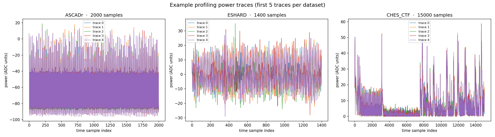
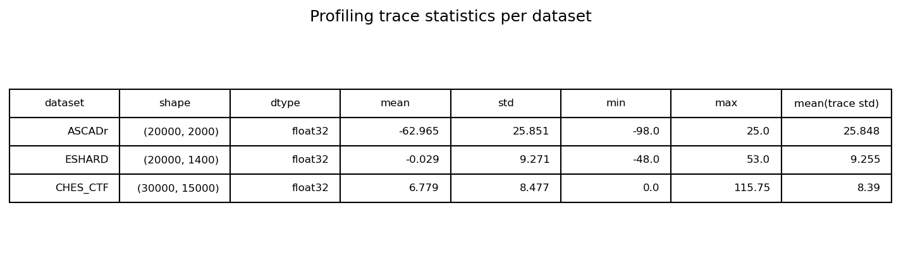
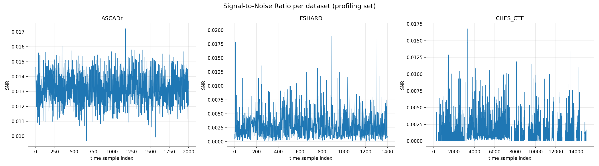

# Chapter 3 — Exploring the data

This is where we finally look at the numbers. We will answer three questions:

1. What do raw power traces look like?
2. How different are the datasets from each other?
3. Where does the key actually leak?

## 1. Raw traces

A trace is just an array of numbers. Plotting a handful of them from each
dataset immediately shows the wide variety of "shapes" — compare the short,
rounded hardware traces of ESHARD with the long, spiky software traces of
CHES_CTF.



Even within a single dataset, traces differ because they correspond to
different plaintexts (and therefore different internal values). That is what
the attack exploits.

## 2. Dataset statistics

A quick summary table — mean, standard deviation, min/max, etc. — tells us
about the *scale* and *noise* of each dataset:



Notice, for instance, that ASCADr traces are stored as `int8` (small integer
raw ADC values) while CHES_CTF is `float16`. These details matter when a model
is pre-processed (scaling) before training.

## 3. Where does the leakage live? — SNR

The most important exploration tool in side-channel analysis is the
**Signal-to-Noise Ratio (SNR)**. For each time sample `t`, we group the
profiling traces by their label and compute:

```text
SNR(t) = variance(mean of group means) / mean(group variances)
```

A high SNR at sample `t` means power at that moment varies **between different
intermediate values** more than it varies *within* the same value — i.e. that
sample is leaking information about our target.



### How to read an SNR plot

- **Tall, narrow peaks** = concentrated leakage at a few time samples or clock
  cycles (typical of software AES where operations run one byte at a time).
- **Low, wide profiles** = leakage spread over many samples (typical of
  hardware with parallel S-boxes, and of masked implementations).
- **Masking pushes peaks down**: a well-masked implementation should show only
  mask-dependent leakage; the unmasked CHES_CTF often shows the clearest peaks.

The SNR tells the deep learning model *where to look*. It is also the
baseline against which we later compare what the network actually learns on
its own (see [Chapter 5](05_feature_emergence.md)).

## Reproduce and play

Everything in this chapter comes from the same scripts you can run yourself:

```bash
analysis/01_plot_traces.py    # raw trace plots
analysis/02_snr.py            # SNR curves
analysis/03_statistics.py     # statistics table
```

they also exist as interactive notebooks in `notebooks/`.

Next: [Chapter 4 — Models and training](04_models_and_training.md).