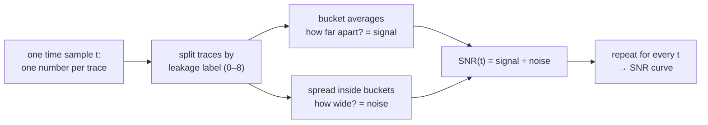

# Chapter 3 — Masking: why one trace is not enough

[Chapter 2](02_intermediate_values.md) defined the intermediate value
`Sbox[plaintext ⊕ key]`. On a **masked** implementation the chip never
computes on that value in the clear. Boolean masking splits a secret `s` into
shares — for example `y = s ⊕ m` with a fresh random **mask** `m` per
encryption — so that recovering `s` requires knowing every share.

A single power trace then sees something randomized by `m`. The unmasked
intermediate is only recoverable *statistically*, over many traces, by
combining leakage from several places in time. A method that looks at one
sample in isolation will miss that; later chapters show how a network can
combine distant samples — and why a single model output is still rarely
enough to name the secret.

## Where the key leaks: Signal-to-Noise Ratio

A trace has thousands of time samples, but only a few of them carry
information about the key. To find them, we score every sample independently
with the *Signal-to-Noise Ratio* (SNR). Fix one time sample `t` and look at
the column of values it takes across all profiling traces. We know the
plaintext and the key of each trace, so we can compute the target intermediate
of each trace — here the Hamming weight of the first S-box output, a label
between 0 and 8 — and split the column into one bucket per label value:

Inside a bucket the intermediate value is fixed, so the remaining spread is
noise — other operations, temperature, measurement error. The bucket averages
move apart only if the measurement at instant `t` genuinely depends on the
intermediate. The figure below shows both cases for two single instants of
ESHARD, where the effect is clearest. On the left, an instant far from the
encryption work: the bucket averages (joined by the red line) coincide, so
knowing the label says nothing. On the right, the instant of highest SNR:
the averages rise with the Hamming weight, while each dot cloud keeps its own
spread. The ups and downs of the red line are the signal; the vertical width
of the clouds is the noise.

Repeating this computation for all 1,400 samples gives the SNR curve. Tall,
narrow peaks mean the leakage is concentrated in a few clock cycles — the
instants where the S-box output is physically computed and moved. Everything
else is the noise floor: activity unrelated to the target byte.

Masking pushes the peaks down. A masked device never computes on the S-box
output directly but on `S-box output XOR mask`, with a fresh random mask per
trace. Bucketing traces by the unmasked label then mixes every possible
masked value into each bucket, the bucket averages collapse onto each other,
and the signal term shrinks. The leakage is not gone — it hides in *joint*
statistics of several samples.

These SNR curves are the physical reference for what follows: they mark
*where* an analyst would look for the key, so that later we can check whether
a trained network looks in the same place. First we need the files that hold
the traces.

← Previous: [Chapter 2 — Intermediate values](02_intermediate_values.md) · [Index](README.md) · Next: [Chapter 4 — The datasets](04_the_datasets.md) →
