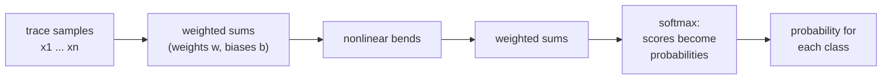
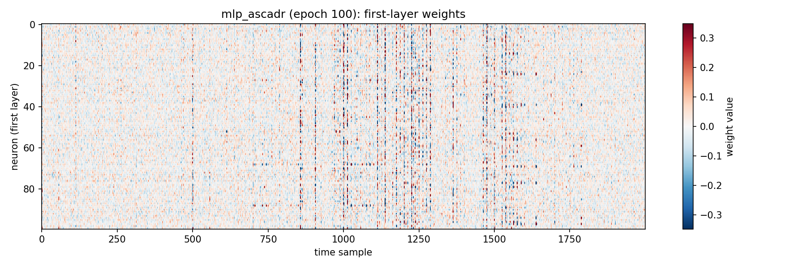
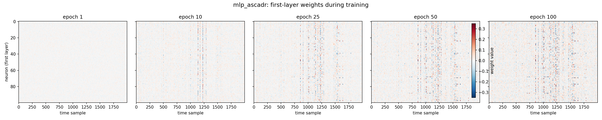

# Chapter 3 — The models

[Chapter 2](02_the_data.md) ended with a map of the leakage: the SNR curves
mark the time samples whose measurements betray the key. A human analyst
could read those curves and design a statistical test by hand. The study
instead lets a neural network figure it out on its own. This chapter builds
up what a neural network is, from zero — no prior knowledge of deep learning
is assumed. It is the foundation the following chapters stand on.

## A network is a function with adjustable numbers

The raw material of a neural network is simple: multiply, add, and
occasionally bend.

Start with one **neuron**. It takes numbers in, multiplies each by its own
**weight** (a knob the network can adjust), adds the results plus one more
knob (**bias**), and passes the total through a small nonlinearity. A worked
example with three inputs:

```text
three samples of a trace:    x = (4.0, −1.0, 0.5)    (scaled units — see below)
the neuron's weights:        w = (0.8, 0.2, −0.1)    bias b = 0.05

weighted sum:  0.8·4.0 + 0.2·(−1.0) + (−0.1)·0.5 + 0.05 = 3.00
```

The nonlinearity ("the bend") then maps the sum to the neuron's output. The
study uses **ELU**, which passes positive values through unchanged and
softens negative ones (`ELU(−2.0) = −0.86`). The bend keeps values from
growing without bound and, crucially, makes the function nonlinear: without
it, chaining layers would collapse into one big linear formula and depth
would add nothing.

A **layer** is a bank of neurons working side by side; a network is layers
chained together, the outputs of one feeding the inputs of the next. Each
added layer lets the network express more complicated relationships between
the inputs.



The last step is the **softmax**. The final layer outputs one raw score per
class, and the softmax turns the scores into probabilities — positive,
between 0 and 1, summing to 1:

```text
raw scores for three classes:  (2.0, 0.5, −1.0)
after softmax:                 (0.79, 0.17, 0.04)      (sum = 1.00)
```

A probability of 0.79 for one class means "given this trace, four chances in
five that this is the intermediate value". The whole network, then, is one
thing: a function from a trace to a probability distribution over classes.

How big is such a function? The ASCADr model — six layers of 100 neurons
each — can be counted by hand:

```text
layer 1:   2,000 × 100 weights + 100 biases      = 200,100
hidden:    5 × (100 × 100 + 100)                 =  50,500
output:    100 × 256 + 256                       =  25,856
                                          ─────────────────
                                   total:          276,456
```

276,456 numbers. Training is the process of setting them.

## Reading a trace: which samples matter?

The MLP multiplies every input sample by its own weight — so the natural
question is: *where are those weights, physically?* The answer is
concrete. A trained model lives in a checkpoint file, and a
checkpoint is an HDF5 file — the same container format as the datasets of
[Chapter 2](02_the_data.md), opened with the same tool. Inside, the weights
are plain numerical arrays:

```text
models/mlp_ascadr_100.weights.h5
├── layers/dense/vars/0     (2000, 100)   ← first layer: one weight per
├── layers/dense/vars/1     (100,)          (time sample, neuron) pair
├── layers/dense_1/vars/0   (100, 100)
├── ...
└── layers/dense_6/vars/0   (100, 256)    ← output layer
```

The first layer is a 2,000 × 100 table: each of its 100 neurons holds its own
list of 2,000 weights — its private "listening profile" over the trace.
Viewed as an image:



Each column is one neuron's 2,000 weights along the trace. Where a column is
strongly colored, that neuron weights those samples heavily; where it is
near-white, it ignores them. And the weights are clearly not uniform: some
time samples are listened to intently, others almost ignored. *Why those and
not others* is exactly the question this study investigates.

That final state was not there from the start. Here is the same matrix read
from a few checkpoints along the way — one color scale for all panels, fixed
by the final epoch, so the change is not re-normalized away:



At epoch 1 the matrix is initialization noise; within a few tens of epochs,
bands condense at specific time samples — the network is learning *where* to
listen. Measuring exactly when this happens, and whether the loud samples
coincide with the SNR peaks of [Chapter 2](02_the_data.md), is the
feature-emergence question of a later chapter.

The **CNN** (convolutional neural network) reads a trace differently. Instead
of one weight per sample, it learns small **kernels** — a strip of, say, ten
weights that slides along the trace. The same strip is applied everywhere,
so a kernel acts as a reusable detector for a local *shape*: a spike, a dip.
Pooling layers then compress the detector outputs, and a couple of dense
layers map them to the classes. Sharing the kernel weights across the whole
trace is why the ESHARD CNN holds only 58,133 numbers against the MLP's
276,456: fewer knobs, but a less direct mapping from "which sample" to
"which weight".

Five model families were trained — one or two architectures per dataset:

| Model family | Dataset | Leakage model | Input samples | Output classes |
|--------------|---------|---------------|---------------|----------------|
| `mlp_ascadr` | ASCADr | identity | 2,000 | 256 |
| `cnn_ascadr` | ASCADr | identity | 2,000 | 256 |
| `mlp_eshard` | ESHARD | Hamming weight | 1,400 | 9 |
| `cnn_eshard` | ESHARD | Hamming weight | 1,400 | 9 |
| `mlp_ches_ctf` | CHES_CTF | Hamming weight | 15,000 | 9 |

A model never sees the key: its input is a trace, its target a label computed
from plaintext and key. Whatever key correlation it achieves, it learned from
traces alone. The exact layer stacks live in the package
(`src/feature_emergence/profiling_and_attack.py`) and are printed layer by
layer in the [companion notebook](notebooks/02_the_models.ipynb).

## Training: adjusting the numbers

Training is supervised learning, the same way a child learns from answered
exercises:

1. Show the network a profiling trace (the question) together with its
   leakage label `Sbox[plaintext ⊕ key]` (the correct answer).
2. Compare the network's 256 probabilities against the correct answer. The
   mismatch is summarized in one number, the **loss**.
3. Nudge every one of the 276,456 numbers a little in the direction that
   reduces the loss (the calculus behind this — *gradient descent* — is
   automatic in TensorFlow).
4. Repeat with the next trace.

The loss used here is **categorical cross-entropy**, which in practice is
just `−log(probability of the true class)`, averaged over traces:

```text
true class: 145
model assigns p(145) = 0.5    →  penalty −log(0.5)  = 0.69
model assigns p(145) = 0.001  →  penalty −log(0.001) = 6.9
```

Confident and right is nearly free; confident and wrong costs ten times
more. That asymmetry is what pushes the network, epoch after epoch, to
put probability mass on the values that actually occur.

One **epoch** is one full pass through the profiling set. Models were trained
for 100 epochs — sweeps over the profiling set in batches of 400 — and the
published CHES_CTF run extends to 200. Before accepting the result of all
that training, though, we should ask what "learning" is supposed to mean
here.

## Generalization: the split from Chapter 2, revisited

[Chapter 2](02_the_data.md) divided every dataset into a profiling set
(everything known) and an attack set (key hidden). The division guards
against a specific failure mode: **overfitting**. A network with 276,456
free parameters is perfectly capable of *memorizing* its training traces —
the way one memorizes an answered exam rather than the subject. A memorizer
scores beautifully on the profiling set and is useless on anything else.

So the network is never judged on the data it trained on. All evaluation in
this book — the attack of the next chapter, the training-time analysis after
it — happens on the attack set: traces the model has never seen, recorded
under different plaintexts and fresh random masks. If the model ranks the
correct key first *there*, it learned something real about the device, not
the answer sheet.

## Scaling the inputs

One practical step remains from [Chapter 2](02_the_data.md): the numbers fed
to the network. The datasets arrive in wildly different units — ASCADr as
raw `int8` ADC codes, CHES_CTF as `float16` — and neural networks train
poorly when inputs have arbitrary offsets and scales. Before training, every
sample of every trace is therefore **standardized**: for each time sample,
subtract the mean and divide by the standard deviation, both measured on the
profiling set:

```text
scaled sample = (raw sample − mean) / std        →  mostly within −3 … +3
```

After scaling, every dataset speaks the same language: mean 0, standard
deviation 1. The attack set is scaled with the *profiling* statistics — the
attack data itself is never used to fit anything.

## Checkpoints: the weights of every epoch

Training these networks takes hours on a GPU — this project has none. What
makes the whole study reproducible on a laptop are the **checkpoints**
published with the paper: the weight file shown above, saved *after each
training epoch* — `..._01.weights.h5` through `..._100.weights.h5` for most
families, and up to `..._200` for the longer CHES_CTF run. The checkpoints
live on [Zenodo](https://zenodo.org/records/15410792), in the same record as
the datasets, and the same script — `scripts/download_files.sh` — fetches
both archives. Like the datasets, they are large binaries excluded from git;
the full inventory is in the [appendix](appendix_datasets.md).

```text
models/
├── mlp_ascadr_01.weights.h5
├── mlp_ascadr_02.weights.h5
├── ...
└── mlp_ascadr_100.weights.h5
```

Loading checkpoint *k* into a freshly built network revives the model exactly
as it stood after epoch *k*. Nothing is retrained. This does two things for
us: the next chapter can use the finished (epoch-100) model as an attack
tool, and a later chapter can watch the model's knowledge evolve epoch by
epoch — the feature-emergence question at the heart of the study.

## The exploration notebook

Everything above — the layer-by-layer summaries, the weight inventory and
heatmap read straight out of the checkpoint, and the epoch-100 load — is
worked through in the **[model notebook](notebooks/02_the_models.ipynb)**.
It needs TensorFlow, so run it in the Docker environment described in the
[index](README.md).

One question is left open. The model outputs probabilities over
*intermediate values* — it never says "key byte 0x2b", it says "value 145,
probability 0.25". The next chapter closes the gap: how 256 such probability
statements, accumulated over many traces, single out one key byte.

← Previous: [Chapter 2 — The data](02_the_data.md) · [Index](README.md) · Next: [Chapter 4 — The attack](04_the_attack.md) →