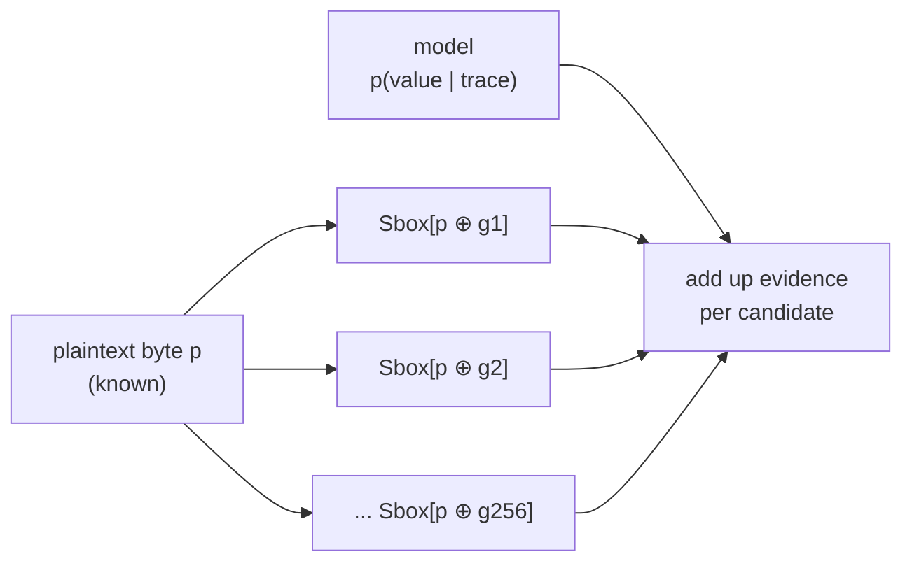
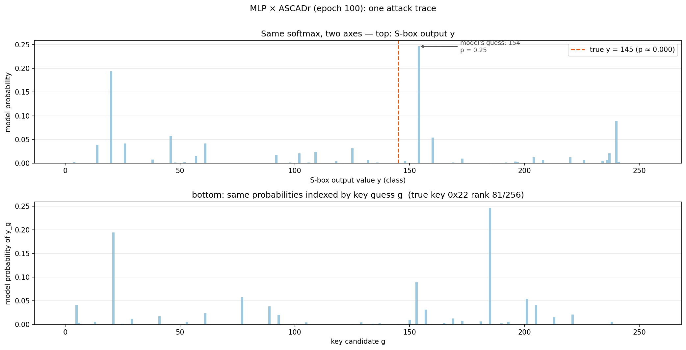
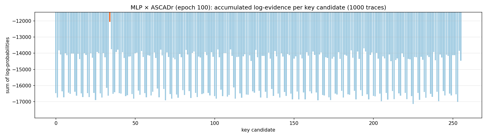
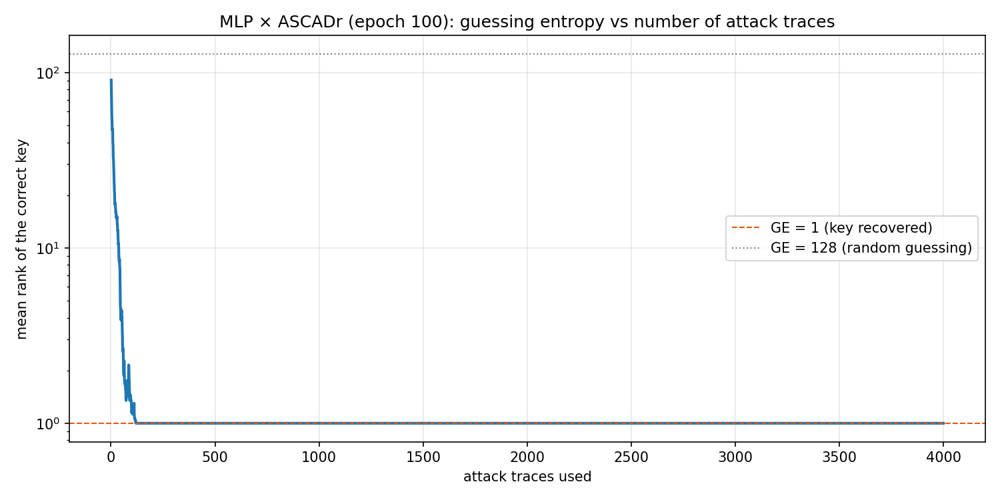

# Chapter 4 — The attack

[Chapter 3](03_models.md) left one question open. The trained model outputs
probabilities over *intermediate values* — it never says "key byte 0x22", it
says "value 145, probability 0.25". This chapter closes the gap: how 256 such
probability statements, accumulated over many traces, single out one key
byte.

## Knowing the plaintext

The attacker is not empty-handed. The attack rests on one assumption,
satisfied in most realistic scenarios (smart cards, authenticators, tokens):
the **plaintext is known**. It was sent to the device in the clear, or the
attacker chose it — and the datasets of [Chapter 2](02_the_data.md) store it
right next to every trace. The key, on the other hand, never leaves the chip.

So the attacker's seat is: *knows the input, measures the power, wants the
key*.

## One key byte, 256 hypotheses

A key byte has 256 possible values. The attacker's move is to **enumerate all
of them**. Recall from [Chapter 1](01_introduction.md) how the key enters the
power consumption: in the first round, each plaintext byte is XOR-ed with one
key byte and passed through the S-box. So for an attack trace with known
plaintext byte `p`, each candidate `g` predicts exactly one intermediate
value: `Sbox[p ⊕ g]`.

Concretely, for the first ASCADr attack trace (`p = 0x8e`):

```text
candidate g = 0x00  →  Sbox[0x8e ⊕ 0x00] = value 25
candidate g = 0x22  →  Sbox[0x8e ⊕ 0x22] = value 145   ← the key actually used
candidate g = 0xff  →  Sbox[0x8e ⊕ 0xff] = value 163
```

Only one row matches what the device actually computed. Every candidate thus
writes its own "would-be truth" over the whole attack set — the dataset
object ships this as a 256 × n_attack matrix, one row per candidate.



Two boundaries of the attack, worth fixing now:

- **One byte at a time.** The AES key has 16 bytes; this procedure recovers
  *one* — here byte 2, the target byte fixed by the study (see the
  [datasets guide appendix](appendix_datasets.md)). Recovering the full key
  means repeating the attack for every byte position.
- **The model still knows nothing about keys.** It only assigns probabilities
  to values. The key ranking is manufactured by the enumeration above — the
  attacker's math, not the network's.

## One trace is not enough

Feed one attack trace to the epoch-100 model and look at its output:



The output is *confident* (one class collects a quarter of the probability
mass) but it is **not** the true value (dashed line). This is the masking
countermeasure of [Chapter 2](02_the_data.md) doing its job: a single trace
carries the *masked* value `Sbox[plaintext ⊕ key] ⊕ mask`, and without the
mask the network can only guess. Over 500 attack traces, the model's best
guess is right on only 4; the true value receives about twice the uniform
probability (0.0089 vs 0.0039) — weak, but systematically above chance.

That sliver of signal is the crack the attack exploits.

## Accumulating evidence

How do weak per-trace signals add up to a strong one? Through probabilities
— and through logarithms.

If traces are independent measurements, the combined probability of a
candidate's story is the *product* of the per-trace probabilities. Products
of many small numbers underflow to zero in floating point, so the standard
trick is to take logs: the product becomes a **sum of log-probabilities**,
and sums are well behaved. A two-trace example:

```text
candidate g implies values with model probability 0.02 and 0.05:
    evidence(g) = log(0.02) + log(0.05) = −3.9 − 3.0 = −6.9
candidate h implies values with model probability 0.01 and 0.20:
    evidence(h) = log(0.01) + log(0.20) = −4.6 − 1.6 = −6.2
```

Candidate `h` is already ahead after two traces, even though `g` won the
second one alone. Every trace casts a vote for every candidate; the winner
is the candidate whose votes are *consistently* least bad.

Applied to the real attack set — for each of the 256 candidates, sum the
model's log-probability of the value that candidate implies, over 1,000
traces:



One orange bar stands out: the true key byte, `0x22`, with accumulated
evidence −12,065 against −13,694 for the best wrong candidate (a margin of
about 1,600 — in combined probability, a factor of e^1600 in favor). The
model never spoke about keys, yet summing its verdicts over 1,000 traces
leaves the true candidate far ahead of the 255 runners-up.

How fast does the winner separate? In the
[notebook's](notebooks/03_the_attack.ipynb) fixed run of traces, the true
key's rank falls from 81 (one trace) to 30 (five traces) to 1 (twenty
traces). The exact count depends on which traces are used — which is why the
standard metric averages over many draws.

## Guessing entropy: scoring a key recovery

The **guessing entropy** (GE) is that averaged metric. The procedure:

1. Draw a random subset of the attack traces.
2. Accumulate the log-evidence of every candidate over the subset, and rank
   the 256 candidates.
3. Average the true key's rank over many draws. That average is the guessing
   entropy: GE = 1 means the attack points at the correct key; GE ≈ 128
   means blind guessing.

The notebook runs 40 draws of 4,000 traces (seeded, so the figure is
reproducible):



The curve collapses from ~128 to 1 within roughly 100 traces, and the
correct key holds rank 1 from trace 86 on. In practical terms: about 86
power measurements of the device are enough to identify one key byte
with certainty — against 256 pure guesses. Each trace contributed only a
whisper of evidence; combined, the whispers decide.

## The exploration notebook

Everything above — the hypothesis table, the single-trace prediction, the
500-trace masking statistics, the evidence chart, and the guessing-entropy
computation — is worked through in the
**[attack notebook](notebooks/03_the_attack.ipynb)**. It runs on CPU in
minutes, no training required.

One question is still untouched. Everything here used the *finished* model —
the weights after epoch 100. But the checkpoints of
[Chapter 3](03_models.md) hold the model after *every* epoch. The study's
real question is: **when, during those 100 epochs, did this attack become
possible?** That is the feature-emergence question, and it is where we go
next.

← Previous: [Chapter 3 — The models](03_models.md) · [Index](README.md) · Next: [Appendix — Datasets guide](appendix_datasets.md) →