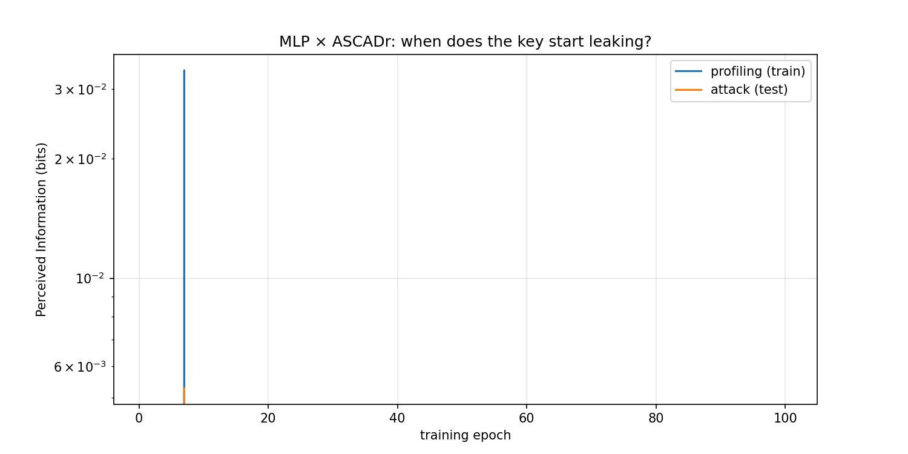

# Chapter 5 — When do features emerge?

This is the heart of the study and of this repository.

## The question

A trained attack model leaks the key — we know that. But it does not learn
instantly. At some point during training the network transitions from
"guessing" to "really attacking". We want to see **when and how** that happens:

> Do the relevant features appear suddenly in one epoch, or do they build up
> gradually? Does the network learn them in the same order as a human analyst
> would (the S-box output, the mask, ...)?

## Perceived Information (PI)

To answer this we need a scalar that measures "how much the key leaks through
the current model". The study uses **Perceived Information (PI)**, a
information-theoretic quantity (in bits) computed from the model's predicted
class probabilities:

```text
PI ≈ H(K) + Σ_k p(k) · E[ log2  p(k | x) ]
```

Loosely: it measures how much the model's outputs reduce the uncertainty about
the key byte. High PI = strong leakage; PI near zero = the model knows
nothing.

The great advantage of the **checkpoints** is that we can evaluate the PI of
the model *at each epoch* — so we can plot a **PI curve over training time**:



## What such a curve usually shows

- **Flat, near zero** for the first epochs: the model is still learning generic
  statistics.
- A **transition region** where PI moves sharply: the useful feature (or the
  wrong — masked — feature) "clicks in".
- A **plateau**: the model has finished learning the leakage it can learn.

> ⚠️ **Why our PI goes *down*?** For ASCADr — a *masked* dataset — the PI we
> measure against the *unmasked* S-box output gets **smaller** as training
> progresses. The model is not learning the key directly; it is tracking the
> *masked* value `Sbox(p ⊕ k) ⊕ r`, which is uncorrelated with the plain
> `Sbox(p ⊕ k)` we score. This *negative/decreasing* PI is exactly the expected
> and reproducible behaviour (see `analysis/04_pi_curves.py`, which reproduces
> the original notebook — including its sign). The plot uses a log scale, so the
> downward drift looks smooth.

The *epoch at which the transition happens*, and whether it happens for the
train and attack sets together (no overfitting) or only for training (the
model memorizes instead of generalizing), is exactly what the paper analyses
and compares across datasets and architectures.

## Digging into the layers

The PI is one global number, but the network has several layers. The study
also looks at the **intermediate activations** (the values inside hidden
layers) to see where in the network — and at what epoch — the information
appears:

- Principal Component Analysis (PCA) of the activations per layer, colored by
  the true intermediate value, shows whether the layer "separates" classes
  (i.e. has learned the feature);
- Scatter plots of specific shares (e.g. `Sbox ⊕ r`, or the mask `r`) reveal
  whether the network is tracking the masked values.

> **[figure: 05_pca_layers.png — activation PCA at an early vs a late epoch]**

This layer-by-layer view is what makes the study "realistic": it is easy to
*believe* an MLP on an unmasked dataset "must" learn the S-box; the paper shows
what masked hardware/software actually does.

## Patching experiments

A clever trick to *prove* what a unit computes: **patching**. We measure a
unit's activation, compare it against the values it *should* depend on (the
S-box, the mask, the masked S-box), and if they match, we **remove** (patch)
that effect — e.g. set the unit to its mean, or rotate it — and measure how
much the PI drops. A big drop means that unit was genuinely carrying that
feature; a small drop means it wasn't.

> **[figure: 05_patching.png — PI before/after patching a specific unit]**

## The takeaway

Feature emergence is **not** a single magic moment. It is a gradual, observable
process that depends on the dataset (masked vs not, hardware vs software) and
on the architecture (MLP vs CNN). Understanding *when* and *how* features
appear is what lets us build more explainable and more robust side-channel
attacks.

Next: [Chapter 6 — Reproducibility](06_reproducibility.md).