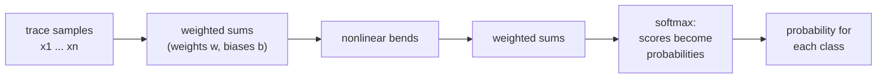

# Chapter 5 — What a neural network is doing here

[Chapter 4](04_the_datasets.md) ended with traces, labels, and a profiling /
attack split. [Chapter 3](03_masking.md) gave the SNR map of where the key
leaks. A human analyst could read those curves and design a statistical test
by hand. The study instead lets a neural network figure it out on its own.

## A network is a function with adjustable numbers

The raw material of a neural network is simple: multiply, add, and
occasionally bend.

Start with one **neuron**. It takes numbers in, multiplies each by its own
**weight** (a knob the network can adjust), adds the results plus one more
knob (**bias**), and passes the total through a small nonlinearity. A worked
example with three inputs:

```text
three samples of a trace:    x = (4.0, −1.0, 0.5)    (scaled units — see next chapter)
the neuron's weights:        w = (0.8, 0.2, −0.1)    bias b = 0.05

weighted sum:  0.8·4.0 + 0.2·(−1.0) + (−0.1)·0.5 + 0.05 = 3.00
```

The nonlinearity ("the bend") then maps the sum to the neuron's output. The
study uses **ELU**, which passes positive values through unchanged and
softens negative ones (`ELU(−2.0) = −0.86`). The bend keeps values from
growing without bound and makes the function nonlinear: without it, chaining
layers would collapse into one big linear formula and depth would add nothing.

A **layer** is a bank of neurons working side by side; a network is layers
chained together, the outputs of one feeding the inputs of the next. Each
added layer lets the network express more complicated relationships between
the inputs.



The last step is the **softmax**. The final layer outputs one raw score per
class, and the softmax turns the scores into probabilities — positive,
between 0 and 1, totaling to 1:

```text
raw scores for three classes:  (2.0, 0.5, −1.0)
after softmax:                 (0.79, 0.17, 0.04)      (sum = 1.00)
```

A probability of 0.79 for one class means "given this trace, four chances in
five that this is the intermediate value". The whole network, then, is one
thing: a function from a trace to a probability distribution over classes.
It never outputs a key byte.

How big is such a function? The ASCADr model — six layers of 100 neurons
each — can be counted by hand:

```text
layer 1:   2,000 × 100 weights + 100 biases      = 200,100
hidden:    5 × (100 × 100 + 100)                 =  50,500
output:    100 × 256 + 256                       =  25,856
                                          ─────────────────
                                   total:          276,456
```

276,456 numbers. Training is the process of setting them
([Chapter 6](06_training_and_checkpoints.md)).

## Reading a trace: which samples matter?

The MLP multiplies every input sample by its own weight — so the natural
question is: *where are those weights, physically?* A trained model lives in
a checkpoint file, an HDF5 file like the datasets of
[Chapter 4](04_the_datasets.md). Inside, the weights are plain numerical
arrays:

```text
models/mlp_ascadr_100.weights.h5
├── layers/dense/vars/0     (2000, 100)   ← first layer: one weight per
├── layers/dense/vars/1     (100,)          (time sample, neuron) pair
├── layers/dense_1/vars/0   (100, 100)
├── ...
└── layers/dense_6/vars/0   (100, 256)    ← output layer
```

The first layer is a 2,000 × 100 table: each of its 100 neurons holds its own
list of 2,000 weights — its private "listening profile" over the trace.
Viewed as an image:


Each column is one neuron's 2,000 weights along the trace. Where a column is
strongly colored, that neuron weights those samples heavily; where it is
near-white, it ignores them. The weights are not uniform: some time samples
are listened to intently, others almost ignored. *Why those and not others*
— and whether they coincide with the SNR peaks of
[Chapter 3](03_masking.md) — is the feature-emergence question of a later
act. Here the heatmap is only a first look at *where* the finished network
listens.

That final state was not there from the start. The same matrix read from a
few checkpoints along the way (one color scale for all panels, fixed by the
final epoch):


At epoch 1 the matrix is initialization noise; within a few tens of epochs,
bands condense at specific time samples — the network is learning *where* to
listen.

The **CNN** (convolutional neural network) reads a trace differently. Instead
of one weight per sample, it learns small **kernels** — a strip of, say, ten
weights that slides along the trace. The same strip is applied everywhere,
so a kernel acts as a reusable detector for a local *shape*: a spike, a dip.
Pooling layers then compress the detector outputs, and a couple of dense
layers map them to the classes. Sharing the kernel weights across the whole
trace is why the ESHARD CNN holds only 58,133 numbers against the MLP's
276,456: fewer knobs, but a less direct mapping from "which sample" to
"which weight".

Five model families were trained — one or two architectures per dataset:

| Model family | Dataset | Leakage model | Input samples | Output classes |
|--------------|---------|---------------|---------------|----------------|
| `mlp_ascadr` | ASCADr | identity | 2,000 | 256 |
| `cnn_ascadr` | ASCADr | identity | 2,000 | 256 |
| `mlp_eshard` | ESHARD | Hamming weight | 1,400 | 9 |
| `cnn_eshard` | ESHARD | Hamming weight | 1,400 | 9 |
| `mlp_ches_ctf` | CHES_CTF | Hamming weight | 15,000 | 9 |

A model never sees the key: its input is a trace, its target a label computed
from plaintext and key. Whatever key correlation it achieves, it learned from
traces alone. The exact layer stacks live in the package
(`src/feature_emergence/profiling_and_attack.py`) and are printed layer by
layer in the [companion notebook](notebooks/02_the_models.ipynb).

How those 276,456 numbers get set — and why we keep a copy after every
epoch — is the next chapter.

← Previous: [Chapter 4 — The datasets](04_the_datasets.md) · [Index](README.md) · Next: [Chapter 6 — Training and checkpoints](06_training_and_checkpoints.md) →
