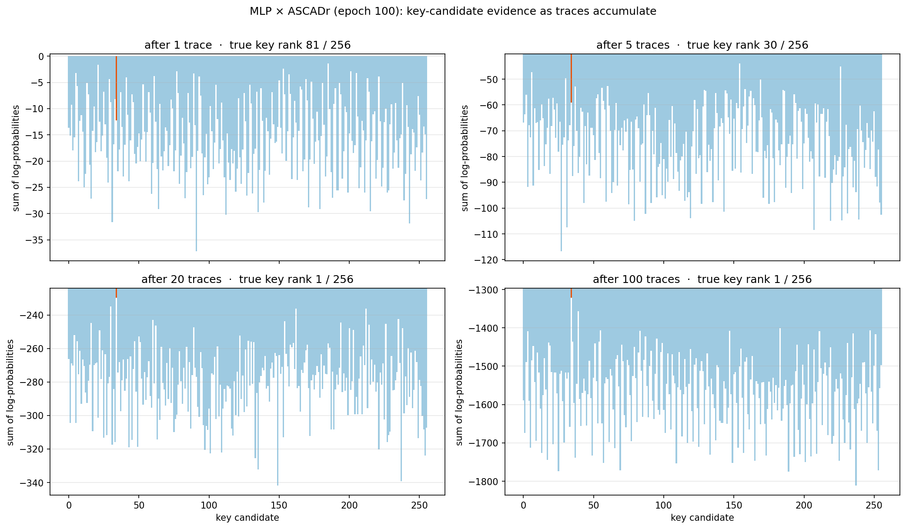

# Chapter 7 — How a key byte is recovered

[Chapter 6](06_training_and_checkpoints.md) left a trained network that maps
a power trace to a probability distribution over *intermediate values*. This
chapter turns those probabilities into a key byte. We use the finished
ASCADr MLP (epoch-100 checkpoint) and the ASCADr attack set: traces the model
has never seen.

This chapter defines **attack success**. It is not the climax of the
project; it is the operational prerequisite for asking *when* and *how* that
success emerged during training.

### Reading order

1. What is known and what is secret.
2. How `y` and `k` are tied by public algebra (exact `y` vs uncertain `y`).
3. What one trace’s softmax looks like — over `y` and, remapped, over key
   guesses.
4. Why many traces must be combined on the key-guess axis (sum of logs).
5. Guessing entropy as the averaged success metric.
6. The notebook that computes the figures.

## 1. What the attacker has

The attack assumes the **plaintext is known**. That is realistic for many
devices (smart cards, authenticators, tokens): the input was sent in the
clear, or the attacker chose it. The datasets of
[Chapter 4](04_the_datasets.md) store the plaintext next to every trace. The
key never leaves the chip.

So the attacker has: the plaintext, a power recording of the encryption, and
no direct access to the key. AES-128 has 16 key bytes; this study recovers
**byte index 2** only (see the [datasets guide](appendix_datasets.md)). The
full key is sixteen independent recoveries of that kind.

## 2. How `y` and `k` are tied

AES-128 is a real block cipher (16-byte state, 10 rounds, public S-box). For
this chapter, one first-round fact is enough. At the target byte position:

```text
y = Sbox[p ⊕ k]
```

- `p` — plaintext byte (**known**),
- `k` — key byte (**secret**),
- `Sbox` — public 256-entry table,
- `y` — intermediate value the network was trained to predict (identity
  leakage model).

Cipher detail (state layout, AddRoundKey, SubBytes, diffusion) and the same
numbers live on the companion page:

**[AES-128 and the S-box](assets/pages/aes_and_sbox.html)**

### Numbers for the ASCADr example

```text
p = 0x8e (142),   k = 0x22 (34)
x = p ⊕ k = 0xac = 172
y = Sbox[0xac] = 0x91 = 145
HW(y) = 3
```

`HW(y)` is the number of 1-bits in `y` (`0x91 = 10010001₂`). Some models
predict HW instead of the full byte; the attack logic below is the same idea.

The S-box is not a gentle map. Neighbours in the input can land far apart in
the output (same public table the datasets use):

```text
input x     dec    Sbox[x] = y     dec    HW(y)
────────────────────────────────────────────────
0x8e        142    0x19            25     3
0x8f        143    0x73            115    5      ← one bit from 0x8e
0xac        172    0x91            145    3
0xad        173    0x95            149    4      ← one bit from 0xac
0x71        113    0xa3            163    4
```

### If `y` were known exactly

The S-box is a public bijection (`Sbox⁻¹` exists). With exact `y` and known
`p`, the key byte is public algebra:

```text
x = Sbox⁻¹[y]
k = p ⊕ x
```

Example: `Sbox⁻¹[145] = 0xac`, then `0x8e ⊕ 0xac = 0x22`. No network needed.

### If `y` is only a probability distribution

The trained network does not output a sure `y`. It outputs 256
probabilities, one per possible S-box output. There is no single value to
pass through `Sbox⁻¹`, so the attack does **not** compute
`k = p ⊕ Sbox⁻¹[ŷ]` from the model’s peak class.

Instead the attacker enumerates every key guess `g ∈ {0,…,255}` and asks
**forward**, with the known `p` of that trace:

```text
y_g = Sbox[p ⊕ g]              # public
vote(g) = P(y_g | power)       # from the softmax
```

Only the true `k` matches what the chip actually computed. Concrete rows for
the first attack trace (`p = 0x8e`):

```text
candidate g     p ⊕ g      y_g = Sbox[p ⊕ g]    HW(y_g)
────────────────────────────────────────────────────────
0x00            0x8e       25                   3
0x01            0x8f       115                  5
0x22            0xac       145                  3      ← true key byte
0xff            0x71       163                  4
```

```text
power → network → P(y=0), …, P(y=255)

g = 0x00  →  take P(y=25)
g = 0x01  →  take P(y=115)
g = 0x22  →  take P(y=145)
g = 0xff  →  take P(y=163)
```

That remapping is a reordering of the same 256 probabilities when `p` is
fixed — not a second model, and not an inverse S-box on the peak. In code,
the dataset stores every `y_g` for every attack plaintext as a matrix of
shape 256 × n_attack (row = guess). It is only a lookup table for the
algebra step.

## 3. One trace is not enough

Feed one attack trace to the epoch-100 model. The figure shows the **same**
softmax twice: top axis = S-box output `y`; bottom axis = key guess `g`
(via `y_g = Sbox[p ⊕ g]`). Orange on the bottom is the true key byte.


The network can look confident — one class may collect about a quarter of
the probability mass — while still missing the true `y`, and while the true
key is not the tallest bar on the bottom. ASCADr is masked
([Chapter 3](03_masking.md)): a single trace carries
`Sbox[plaintext ⊕ key] ⊕ mask`, randomized per encryption. Without the
mask, the network cannot name the unmasked value from one recording.

Over the first 500 attack traces the model’s best guess is right on only 4;
the true value receives about twice the uniform probability (0.0089 vs
0.0039). That is above chance, and it is not enough to call the key from one
shot.

## 4. Accumulating votes across traces

### Why not average many top panels?

The top panel’s horizontal axis is `y`. Each encryption uses a different
plaintext byte `p`, so the true

```text
y = Sbox[p ⊕ k]
```

sits on a **different class** on almost every trace. Averaging those softmax
vectors blurs peaks that were never aligned.

What stays fixed is the key byte. For every trace the attacker builds the
**bottom-style** scores (one probability per `g`) and combines those scores
across traces.

### Product of probabilities, sum of logs

If traces are treated as independent, the combined score for guess `g` is
the product of its per-trace votes:

```text
score(g) = P(y_g | trace 0) × P(y_g | trace 1) × … × P(y_g | trace n−1)
```

A long product of numbers in (0, 1) underflows in floating point. The
logarithm turns the product into a sum without changing which `g` wins:

```text
evidence(g) = Σ log P(y_g | trace i)
```

Toy comparison over two traces:

```text
g with probs 0.02 and 0.05:  evidence = log(0.02)+log(0.05) = −6.9
h with probs 0.01 and 0.20:  evidence = log(0.01)+log(0.20) = −6.2
```

Candidate `h` leads after two traces even though `g` won the second vote
alone.

### What that looks like as traces are added

Each panel below is evidence for all 256 key candidates after the first `n`
attack traces (fixed order). Orange is true key `0x22`; the title is its
rank:



After one trace the true byte is lost in the pack (rank 81). After five it
is at 30; after twenty it is already first. Same ranking after 1,000 traces:


One orange bar stands out (`0x22`: evidence −12,065 against −13,694 for the
best wrong candidate). The network still only named *values*; the key
ranking is built from the hypothesis table. Which traces are drawn changes
when rank 1 appears — hence the averaged metric next.

## 5. Guessing entropy

**Guessing entropy** (GE) averages that battle over many random draws:

1. Draw a random subset of the attack traces.
2. Accumulate log-evidence for every candidate; rank the 256.
3. Average the true key’s rank over many draws.

GE = 1 means the attack points at the correct key; GE ≈ 128 is blind
guessing. The notebook runs 40 draws of 4,000 traces (seeded):


The curve falls from ~128 to 1 within roughly 100 traces; the correct key
holds rank 1 from trace 86 on. About 86 power measurements identify one key
byte against 256 pure guesses. That is the definition of success used here
when we say the attack works.

## 6. Notebook and next question

The same steps are in the
**[attack notebook](notebooks/03_the_attack.ipynb)** (CPU, minutes; no
training).

Everything above used the finished model — weights after epoch 100. The
checkpoints of [Chapter 6](06_training_and_checkpoints.md) also hold every
earlier epoch. The next question is when, during those 100 epochs, this
attack became possible.

← Previous: [Chapter 6 — Training and checkpoints](06_training_and_checkpoints.md) · [Index](README.md) · Next: [Appendix — Datasets guide](appendix_datasets.md) →
