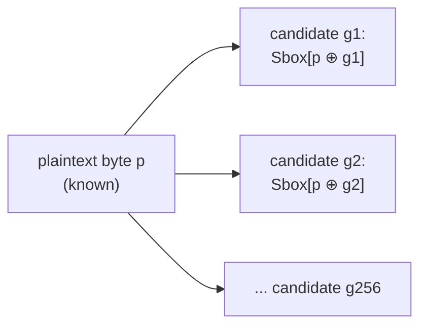

# Chapter 7 — How a key byte is recovered

[Chapter 6](06_training_and_checkpoints.md) left a trained network that maps
a power trace to a probability distribution over *intermediate values*. This
chapter turns those probabilities into a key byte. We use the finished
ASCADr MLP — the epoch-100 checkpoint — and the ASCADr attack set: traces
the model has never seen.

This chapter defines **attack success**. It is not the climax of the
project; it is the operational prerequisite for asking *when* and *how* that
success emerged during training.

## What the attacker knows

The attack assumes the **plaintext is known**. That is realistic for many
devices (smart cards, authenticators, tokens): the input was sent in the
clear, or the attacker chose it. The datasets of
[Chapter 4](04_the_datasets.md) store the plaintext next to every trace. The
key never leaves the chip.

The attacker therefore sits with the input, a power recording of the
encryption, and no direct access to the key.

## 256 hypotheses for one key byte

A key byte has 256 possible values. The attacker enumerates all of them.
Recall from [Chapter 2](02_intermediate_values.md) how the key enters the
first AES round: for an attack trace with known plaintext byte `p`, each
candidate `g` predicts exactly one intermediate value:

```text
Sbox[p ⊕ g]
```

Concretely, for the first ASCADr attack trace (`p = 0x8e`):

```text
candidate g = 0x00  →  Sbox[0x8e ⊕ 0x00] = value 25
candidate g = 0x22  →  Sbox[0x8e ⊕ 0x22] = value 145   ← the key actually used
candidate g = 0xff  →  Sbox[0x8e ⊕ 0xff] = value 163
```

Only one row matches what the device computed. The dataset object ships the
full table as a matrix of shape 256 × n_attack: row `g` holds the label every
attack trace would have had *if* `g` were the key byte.



The procedure recovers **one byte at a time**. AES-128 has 16 key bytes;
here we recover the target byte fixed by the study (byte 2 — see the
[datasets guide](appendix_datasets.md)). The full key needs the same attack
repeated for every byte position.

## One model output is not a key

Feed one attack trace to the epoch-100 model. The output is a softmax: one
probability per possible S-box output (256 classes).


The network is *confident* — one class collects about a quarter of the
probability mass — but that class is **not** the true intermediate value
(dashed line). ASCADr is masked ([Chapter 3](03_masking.md)): a single trace
carries `Sbox[plaintext ⊕ key] ⊕ mask`, randomized per encryption. Without
the mask, the network cannot name the unmasked value from one recording.

There is still a weak signal. Over the first 500 attack traces, the model's
best guess is right on only 4; the true value receives about twice the
uniform probability (0.0089 vs 0.0039). That is above chance, and it is not
enough to call the key from one shot. The attack needs many traces.

## Accumulating evidence across traces

Each candidate `g` implies a label on every attack trace. The model assigns a
probability to that label. If traces are independent measurements, the
combined evidence for `g` is the *product* of those probabilities. Products of
many small numbers underflow in floating point, so we work with logarithms:
the product becomes a **sum of log-probabilities**.

A two-trace example:

```text
candidate g implies values with model probability 0.02 and 0.05:
    evidence(g) = log(0.02) + log(0.05) = −3.9 − 3.0 = −6.9
candidate h implies values with model probability 0.01 and 0.20:
    evidence(h) = log(0.01) + log(0.20) = −4.6 − 1.6 = −6.2
```

Candidate `h` is ahead after two traces, even though `g` won the second one
alone. Every trace casts a vote for every candidate; the winner is the
candidate whose votes are consistently least bad.

Applied to the real attack set — for each of the 256 candidates, sum the
model's log-probability of the value that candidate implies, over 1,000
traces:


One orange bar stands out: the true key byte, `0x22` (evidence −12,065
against −13,694 for the best wrong candidate). The network still only named
*values*; the ranking of key candidates is the attacker's construction from
the hypothesis table.

In one fixed run of traces in the notebook, the true key's rank falls from 81
(one trace) to 30 (five traces) to 1 (twenty traces). The exact count depends
on which traces are drawn — which is why the standard metric averages over
many draws.

## Guessing entropy

**Guessing entropy** (GE) is that averaged score:

1. Draw a random subset of the attack traces.
2. Accumulate the log-evidence of every candidate over the subset, and rank
   the 256 candidates.
3. Average the true key's rank over many draws. GE = 1 means the attack
   points at the correct key; GE ≈ 128 means blind guessing.

The notebook runs 40 draws of 4,000 traces (seeded, so the figure is
reproducible):


The curve falls from ~128 to 1 within roughly 100 traces, and the correct key
holds rank 1 from trace 86 on. About 86 power measurements identify one key
byte against 256 pure guesses. That is the definition of success used here
when we say the attack works.

## The exploration notebook

The same steps are worked through in the
**[attack notebook](notebooks/03_the_attack.ipynb)**. It runs on CPU in
minutes; no training is required.

Everything above used the *finished* model — the weights after epoch 100.
The checkpoints of [Chapter 6](06_training_and_checkpoints.md) also hold the
model after every earlier epoch. The next question is when, during those 100
epochs, this attack became possible.

← Previous: [Chapter 6 — Training and checkpoints](06_training_and_checkpoints.md) · [Index](README.md) · Next: [Appendix — Datasets guide](appendix_datasets.md) →
