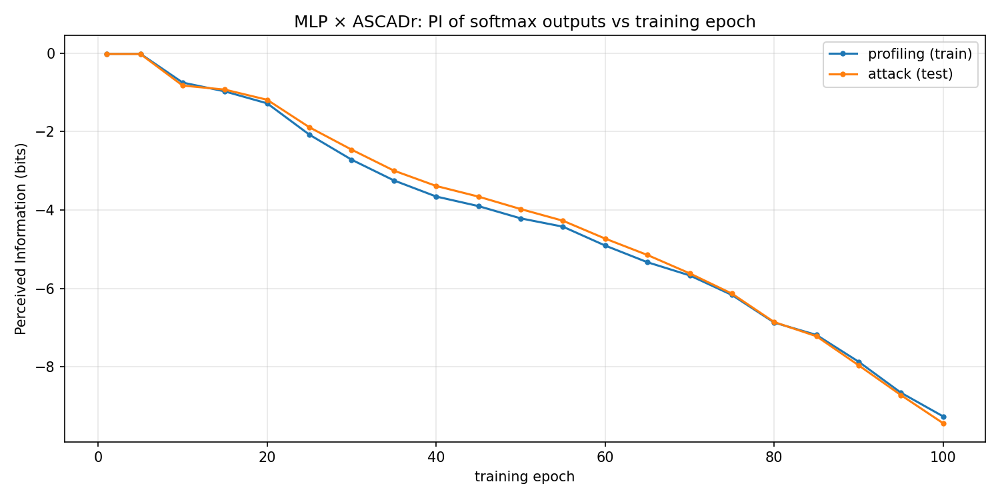

# Chapter 8 — Perceived Information

[Chapter 7](07_scoring_the_attack.md) answered **how** a finished model
recovers a key byte: remap each softmax onto key guesses, multiply votes
across traces, watch guessing entropy fall to 1. For the epoch-100 ASCADr
MLP that took on the order of **86 attack traces**.

That leaves a different question. The weights at epoch 100 are not the
weights at epoch 1. **Why** does that finished network produce softaxes that
are worth accumulating at all? Something must change during the 100 training
epochs. This chapter introduces the scalar used to watch that change:
**Perceived Information (PI)**.

### Reading order

1. Why Chapter 7’s “how” is not enough.
2. Why a new metric (PI), not only GE on every checkpoint.
3. What PI is, in bits, from the same softmax tables.
4. Why plot PI against **epoch**.
5. What that means on masked ASCADr — and what it does not mean.
6. The open question that starts Act III.

## 1. Why “how the attack works” is not “why the model can attack”

Chapter 7 used **one** checkpoint: the end of training. The attack recipe
(hypotheses, product of votes, GE) would be the same at epoch 10 or epoch
50; only the softaxes change. If early softaxes put almost no mass on the
true `y`, products of votes stay uninformative and GE stays near random.

So the operational success in Chapter 7 already assumes an answer to a prior
“why”: *because, by epoch 100, the model’s outputs carry usable information
about the intermediate label.* Chapter 8 makes that assumption measurable.

The first-layer weight maps of [Chapter 5](05_the_network.md) suggested
*where in time* the network listens. That is intuition about the input side.
PI asks about the **output** side: how much the probability tables know.

## 2. Why not only recompute guessing entropy every epoch?

One could, in principle, run the full Chapter 7 attack on every checkpoint
and plot “traces to GE = 1” versus epoch. That remains a valid check. It is
also heavy (many random draws, many traces, 100 models) and it still answers
an **attack** question: after enough measurements, is the true key first?

PI answers a narrower **output** question with one number per checkpoint:

> Given the softmaxes and the true labels, how informative are those
> probability tables about the sensitive variable *on individual traces*?

| | Guessing entropy (Ch. 7) | Perceived Information (this chapter) |
|---|---|---|
| **Why use it** | Declare attack success | Watch learning in the outputs |
| **Object** | Ranking of key guesses `g` | Softmax over labels `y` |
| **Combines many traces?** | Yes (product / sum of logs) | No — aggregates per-trace log-probs of the true class |
| **Typical x-axis** | Number of attack traces | Training epoch |
| **Typical success shape** | Curve → 1 | Curve moves when outputs become informative |

Same network outputs; different “why.” GE asks why the *scoreboard* of key
candidates eventually picks a winner. PI asks why those *votes* were worth
casting in the first place.

## 3. What PI is

The package function `information` in `profiling_and_attack.py` estimates a
mutual-information-style quantity in **bits** between the sensitive label
(here the identity intermediate class) and the model’s predicted
probabilities.

Operationally, with 256 classes:

1. Estimate the label frequencies \(p(k)\) on the evaluation set.
2. Start from the label entropy \(H(K)\) in bits.
3. For each class \(k\), average \(\log_2 P(y=k)\) over traces whose true
   label is \(k\), weight by \(p(k)\), and add.

If, whenever the true class is \(k\), the softmax puts substantial mass on
\(k\), PI rises. If the true class is buried (as on the single-trace example
in Chapter 7, where true `y = 145` had probability ~10⁻⁶), those terms pull
PI down.

**Limit:** PI is scored against the **labels we choose**. In this thread that
is the unmasked identity label `y = Sbox[p ⊕ k]`. PI is not “bits of the AES
key” in the GE sense, and it is not a proof of what a hidden layer computes.

## 4. Why plot PI against epoch

[Chapter 6](06_training_and_checkpoints.md) saved weights after every epoch.
No retraining is required:

```text
for selected epochs e in 1 … 100:
    load mlp_ascadr checkpoint e
    predict softmaxes on profiling traces and on attack traces
    PI_train(e), PI_attack(e) ← information(...)
```

The companion notebook evaluates every fifth epoch (plus the endpoints).
Plotting those series is the point of the metric: a stretch that barely moves
means the outputs are stable for this labelling; a clear move means training
changed what the softmaxes know. Train and attack curves moving together
means the change generalizes; only the train curve moving suggests
memorization.



On this ASCADr MLP run, PI against the **unmasked** identity label sits near
0 at epochs 1–5 (about −0.02 bits on both sets), then falls steadily: by
epoch 10 already near −0.8 bits on the attack set, and by epoch 100 about
−9.3 bits (train) and −9.4 bits (attack). The two curves stay close — whatever
is changing generalizes off the profiling set.

That plot is a **seismograph** of learning in the outputs. It does not yet
open the box (no PCA, no patching). It tells *when* to look. Reading the
vertical direction needs the masked-data caveat next.

## 5. Why ASCADr’s curve looks “wrong” at first glance

Lower (more negative) PI here does **not** mean “the attack is getting
worse.” Chapter 7 already showed GE → 1 for the epoch-100 model. The scalar
is asking a different question: how well do the softmaxes match the
**unmasked** label `y = Sbox[p ⊕ k]`?

ASCADr is masked ([Chapter 3](03_masking.md)). The chip does not expose that
plain `y` alone. As training proceeds, the network can organize around
*masked* structure while this PI score keeps grading the model against the
unmasked class. Agreement with that labelling can fall even as multi-trace
key ranking (Chapter 7) becomes possible — weak, biased votes about `y_g`
can still multiply into a winner.

**Limits:**

- PI ≠ GE. One is about per-trace label informativeness under a chosen
  labelling; the other is about ranking key guesses over many traces.
- A decreasing PI curve on ASCADr is expected for this labelling choice; it
  is not a contradiction of attack success.
- PI still does not prove what a hidden layer computes. It only marks *when*
  the outputs’ relationship to the unmasked label changes — preparation for
  asking *what* appeared inside the net at those moments.

## 6. Next

We can now say **why** a scalar over training is needed after the Chapter 7
recipe: to see when the softaxes become worth accumulating. The remaining
question is sharper:

**When** along the 100 epochs does PI move, and do profiling and attack move
together?

That is the start of Act III — phase transitions during training.

← Previous: [How many traces](how_many_traces.md) · [Index](README.md) · Next: [Appendix — Datasets guide](appendix_datasets.md) →
