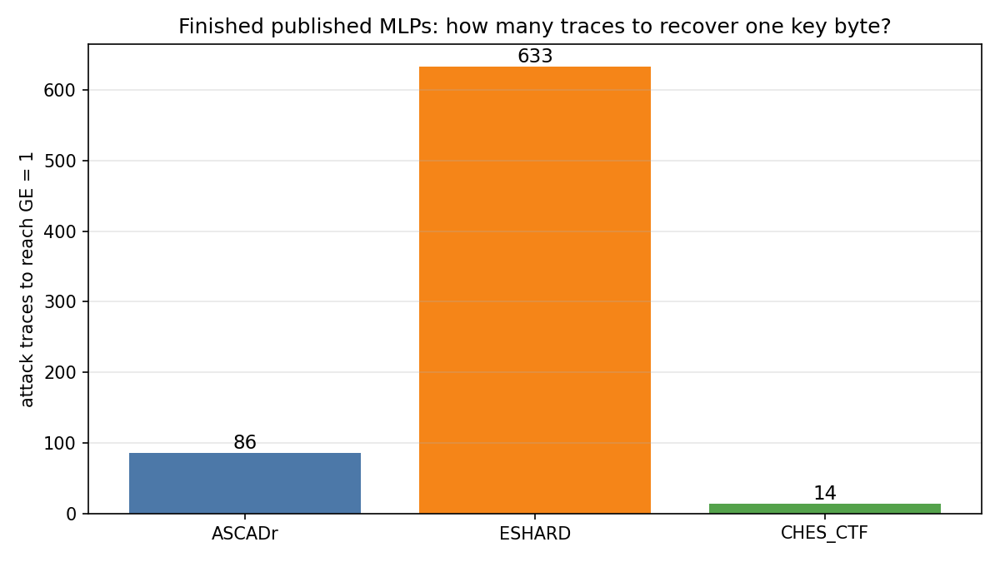
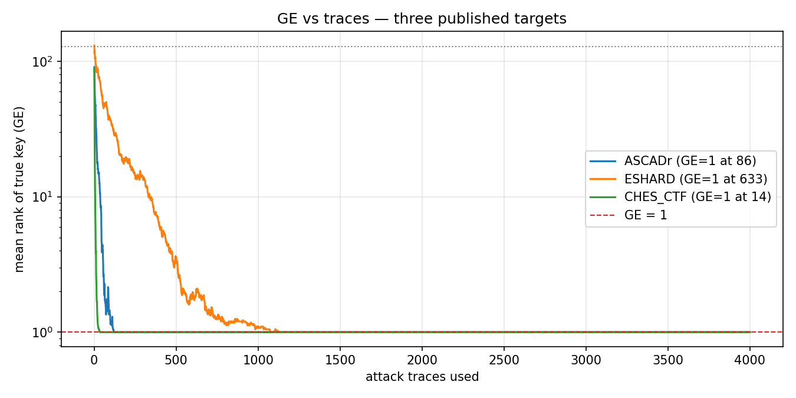

# Chapter — How many traces

[Chapter 7](07_scoring_the_attack.md) showed *how* to multiply votes until
guessing entropy reaches 1 — about **86** attack traces for the finished
ASCADr MLP. This chapter asks what that number **means**, and why it is not
tied to “100 training epochs.”

## Claim

**Traces to GE = 1** measures how hard it is to recover one key byte with a
given attack pipeline on a given device. A **larger** number means each
trace leaks less usable information under that attack — typically because
the implementation’s countermeasures (masking, noise, measurement) leave a
weaker per-trace signal.

That count is **not** related to how many epochs the network was trained.
On ASCADr we happen to see ~86 traces and 100 epochs side by side; that
similarity is a **coincidence**. Epochs belong to the learning clock
([Chapter 8](08_perceived_information.md)). Traces belong to the attack
clock (Chapter 7).

## Definition

After Chapter 7’s ranking procedure, **guessing entropy (GE)** is the mean
rank of the true key over many random draws of attack traces. The smallest
number of traces at which that mean rank hits 1 is **traces to GE = 1**.

For the finished ASCADr MLP (identity labels, epoch-100 checkpoint) that
number is **86**.

## Coincidence to discard

| Quantity | Clock | Example (ASCADr MLP) |
|---|---|---|
| Training epochs | Learning | 100 checkpoints |
| Traces to GE = 1 | Attack | 86 |

Same finished model appears in both stories. The numbers are not required to
match and do not explain each other.

## Evidence: three published targets

The repository ships finished MLPs and datasets for ASCADr, ESHARD, and
CHES_CTF. Using each target’s published leakage model and final checkpoint,
the same GE procedure (40 random draws, up to 4,000 attack traces, seed 42)
gives:

| Target | Leakage labels | Traces to GE = 1 | Setup (short) |
|---|---|---:|---|
| CHES_CTF | Hamming weight (9) | **14** | power CTF target; MLP epoch 200 |
| ASCADr | identity (256) | **86** | masked power; MLP epoch 100 |
| ESHARD | Hamming weight (9) | **633** | masked EM; MLP epoch 100 |

The bars are not equal. Under this repo’s published pipelines, CHES_CTF is
recovered with far fewer traces than ASCADr; ESHARD needs hundreds more.
**Traces to GE = 1 moves with the system.** ASCADr’s training run length
(100 epochs) does not explain ASCADr’s 86, and cannot explain 14 or 633 on
the other targets.

The comparison is produced by `analysis/05_traces_to_ge1.py`.

**Limits:** the three pipelines are not identical (architecture width, ID vs
HW, sample length, epoch count). The figure reads the *published artifacts
in this repo*; it is not a controlled ablation that changes only one
countermeasure. It is enough to show that the hardness score is
system-dependent, not an echo of “~100 epochs.”

## What a designer can do with the number

You do not need a full mechanistic story to use traces to GE = 1 as a
**relative** guide:

- ESHARD needs **633** traces here and ASCADr **86** → under this attack
  style ESHARD is harder; something in its implementation or measurement
  leaves less usable signal.
- CHES_CTF needs **14** → under this pipeline it leaks more usable signal.
- If a countermeasure change raises traces to GE = 1, the change helped
  *against this attacker*, even if you cannot yet name the feature the
  network was using.
- If the number barely moves, the change did not buy protection against
  this pipeline.

That is not a complete secure-design recipe. It does not replace knowing
what leaks. It is a **scoreboard** for comparing systems and iterations:
who is doing better, and whether a change improved the filtering of
information an SCA attacker can use.

## Bound

- Traces to GE = 1 depends on the **attack** (model, leakage model, ranking
  method) as well as the device. A stronger model can lower the count
  without the chip changing.
- It does not say *what* is leaking (mask, share, S-box, …).
- The combination rule (product of votes) remains Chapter 7; this chapter
  only interprets the resulting sample size.

## Next

Traces to GE = 1 is a system-dependent hardness score for this attack — not
an echo of the training epoch count. Comparing ASCADr, ESHARD, and CHES_CTF
shows which setup leaks less under the same recovery procedure.

The open question shifts to the learning clock: when and why the model’s
outputs become informative across **epochs** — [Chapter 8 — Perceived
Information](08_perceived_information.md).

← Previous: [Chapter 7 — Scoring the attack](07_scoring_the_attack.md) · [Index](README.md) · Next: [What changes during learning](what_learning_changes.md) →
