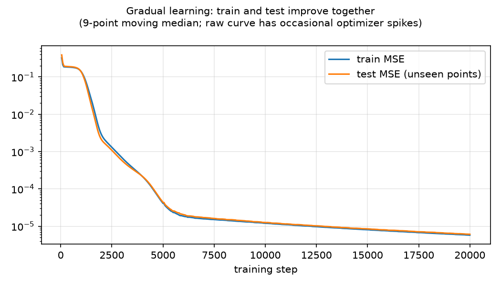
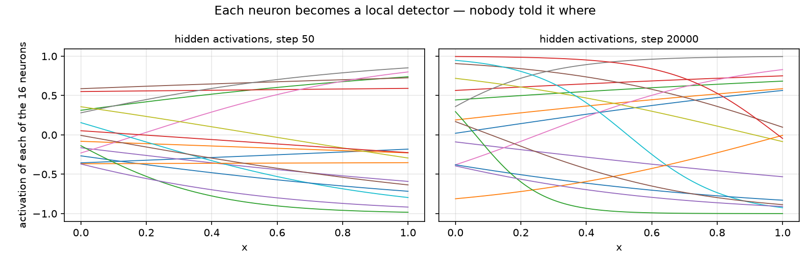
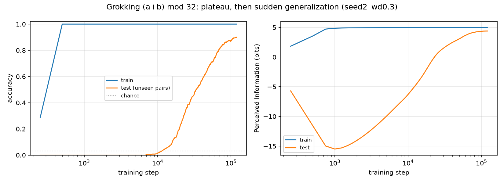
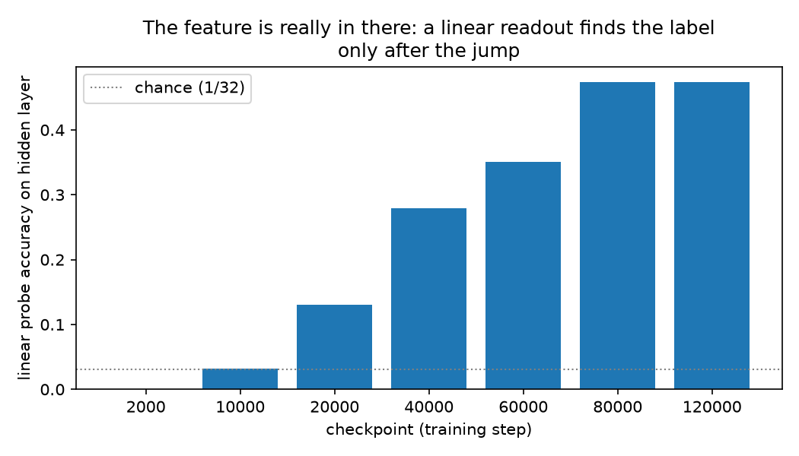
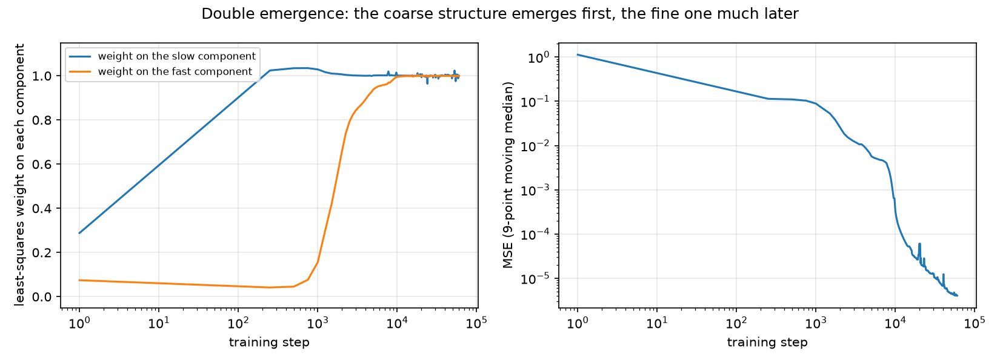
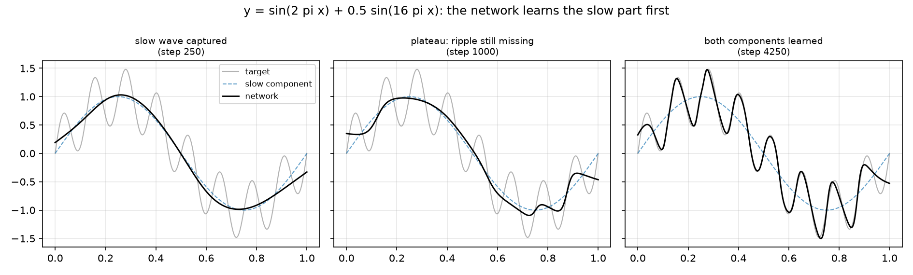

# Interlude — Feature emergence in toy networks

Chapter 6 showed how training sets the weights, epoch by epoch, and why we
keep a checkpoint of every epoch. What it did not show is what learning
looks like while it happens. Does a network improve a little every step, or
can it look stuck for a long time and then change suddenly?

That question is the heart of this manual. The paper we follow notes that
learning from masked side-channel data resembles *grokking*: a model
memorizes its training data, shows no progress on unseen data for a long
time, and then generalizes suddenly. The paper's analysis starts by
locating those sudden jumps in real side-channel models.

Before doing that on power traces, we reproduce the phenomenon in the
smallest laboratory that can show it: toy networks learning mathematical
functions, trained from scratch on a laptop in minutes. Every figure comes
from a short numpy script. No TensorFlow, no GPU, nothing hidden.

Three experiments, three lessons:

- **A.** Learning a smooth function: gradual, visible progress.
- **B.** Learning a rule: a long plateau, then a sudden jump.
- **C.** One network, two jumps: coarse structure first, fine structure
  later.

## A. Learning a smooth function

The first task is the classic one: learn `y = sin(2πx)` from 400 scattered
points. To make generalization visible, the network trains on only 70% of
the points. The other 30% are held out and never shown.

The network is the smallest one that can do the job: one hidden layer of 16
neurons (`tanh`) and one linear output. Same multiply–add–bend machinery as
Chapter 5, a few hundred adjustable numbers in total.


Read the panels left to right. At step 50 the network is nearly a straight
line. At step 500 it follows the overall trend. By step 3,000 it hugs the
curve, and by step 20,000 the fit is exact, including over the orange
points it never saw. That last fact is generalization, made visible: the
curve is right even where there was no data to copy.



This second figure shows the same run as error over time: training and test
error fall together, smoothly. (The raw curve has occasional single-step
spikes where Adam takes a step that is too long; the plot shows a 9-point
moving median, which removes that optimizer noise without touching the
trend.)

What happened inside? Each hidden neuron computes `tanh(w·x + b)`, a soft
step whose transition sits at position `−b/w`. At initialization the
transitions are scattered at random. After training they tile the interval
at distinct positions, and the output layer adds them with the right signs
to trace the sine.



This is the first honest meaning of *feature emergence*: nobody placed
those steps; gradient descent slid each one to where it reduces the error.
But nothing was hidden here: progress was visible from the first steps.
The interesting case is when progress is invisible for a long time.

## B. Learning a rule: the plateau and the jump

The second task looks even simpler. Given two numbers `a` and `b` between 0
and 31, predict `(a + b) mod 32`: the remainder after wrapping around, like
clock arithmetic (27 + 9 = 36, which is 4 on a 32-hour clock).

There are 1,024 possible pairs. The network sees each pair as two one-hot
vectors (32 zeros with a single 1 at position `a`, and the same for `b`),
passes them through one hidden layer of 128 neurons, and outputs a softmax
over 32 classes. We train on half of the pairs and keep the other half
unseen. We also add *weight decay*: every weight is shrunk by a tiny factor
at every step, which makes complicated memorizing solutions expensive.



The left panel is accuracy; the run shown is seed 2 with weight decay 0.3.
It has three phases:

1. **Memorization** (steps 1 to ~2,000). Training accuracy hits 100%. Test
   accuracy stays at chance, 1/32 ≈ 3%. The network is a lookup table.
2. **The plateau** (steps ~2,000 to ~10,000). Nothing seems to happen. An
   observer watching only test performance would say the model is stuck.
3. **The jump** (steps ~10,000 to ~70,000). Test accuracy climbs to 90%.
   The network found the general rule, how the two numbers combine
   circularly, and weight decay made that solution cheaper than the lookup
   table.

The right panel tells the same story with a metric we will use on the real
models: **Perceived Information** (PI). In one sentence, PI measures in
bits how much the output probabilities know about the true label: 0 is
chance, and log2(32) = 5 bits is perfect (Chapter 8 defines it properly).
During memorization, PI on the unseen pairs sinks to −15 bits: confidently
wrong is worse than chance. During the plateau it stays there. At the jump
it climbs to 4.4 bits. PI sees the event exactly when the outputs become
informative, not before.

Is the answer actually *inside* the network during the plateau, or does it
only appear at the jump? To check, we freeze the network at several
checkpoints and ask a **linear probe**: a one-layer classifier trained to
decode the remainder from the 128 hidden activations (70% of the unseen
pairs to train the probe, 30% to score it). Each bar below is that score.
The dotted line is chance.



At step 2,000 the probe scores 0%: the remainder is not readable from the
hidden layer at all. After the jump it reaches 47%: a linear readout now
finds the answer (the probe is only linear and only sees one layer, which
is why it reads 47% where the full network scores 90%). And one detail
worth keeping: the probe starts climbing around step 20,000, slightly
*before* test accuracy does. The representation reorganizes inside before
the outputs show it. Watching for that signature in real models is what
Act III is about.

**What this does not prove.** Grokking in modular arithmetic is documented
in the literature; here we only confirm it reproduces on a laptop, with our
metric, in minutes. The toy has no side channel and no secret key, so
nothing here says anything about power traces yet. The bridge comes after
the next experiment.

## C. Two emergences in one network

On CHES_CTF, the paper observes emergence in *two* jumps: the network first
separates coarse structure (high vs low Hamming weight) and only later fine
structure (even vs odd). Can a toy network show two jumps?

An honest warning: we first tried to force it with modular arithmetic,
learning `(a + b) mod 16` and measuring PI against coarse and fine readings
of the same label. Across 24 configurations the fine label never
generalized at all. Two jumps are not automatic.

So instead we use a task where two scales exist naturally: a sum of two
functions, a slow wave plus a fast ripple,

```text
y = sin(2πx) + 0.5·sin(16πx)
```

Neural networks exhibit *spectral bias*: they fit low frequencies before
high ones. To watch each scale separately, at every logged step we fit the
network's output as `α_slow·(slow wave) + α_fast·(fast ripple)` by least
squares and record the two coefficients. Each α starts near 0 and reaches 1
when the network has learned that component.



Left panel: the weight on the slow wave crosses 0.9 at step 250. The weight
on the fast ripple stays near zero until about step 1,000, then snaps up
and crosses 0.9 at step 4,250. Two jumps, one network, nothing staged.
Right panel: the same run as plain MSE. The error falls, then sits at ≈0.1
for thousands of steps. That plateau value is not arbitrary: it is the
variance of the ripple (0.5²/2 = 0.125), the error of a network that has
learned everything except the ripple. Then the second drop takes the error
to ≈4×10⁻⁶.



The middle panel is the photograph of the plateau: the network matches the
slow wave exactly, and everything it still gets wrong is the ripple it has
not yet learned.

**What this does not prove.** Spectral bias explains *why* the coarse
scale comes first here; it does not explain the paper's two jumps, where
the scales are Hamming-weight features of secret shares. The toy shows
that one network can acquire two features at two very different times. It
does not say the real model's two jumps have the same cause.

## What transfers to the real chapters

Three lessons carry over:

- **Learning can be invisible for a long time.** A model can look finished
  (100% training accuracy) and be worthless, or look stuck (chance-level
  test accuracy) and be on the verge of generalizing. Only a metric
  watched per epoch can tell which.
- **Emergence is the appearance of structure, not gradual improvement.**
  In the toy we verified the structure directly: the probe reads the label
  from the hidden layer only after the jump. On real models we will have
  to hunt for that structure, and that hunt is Act III.
- **This is why we saved every epoch.** The checkpoints of Chapter 6 exist
  so that the jump, if there is one, is caught on camera.

And one honest limit. The toy has no side channel and no key byte to rank,
so guessing entropy, the metric of Chapter 7, has no analog here. The
bridge between the two worlds is PI: it is defined on any classifier's
outputs, toy or real. The next time PI appears, in Chapter 8, it will be
measured on the real ASCADr model, and the question will be the one this
chapter prepared: when, during those 100 epochs, do the outputs become
informative?

← [Index](README.md)
