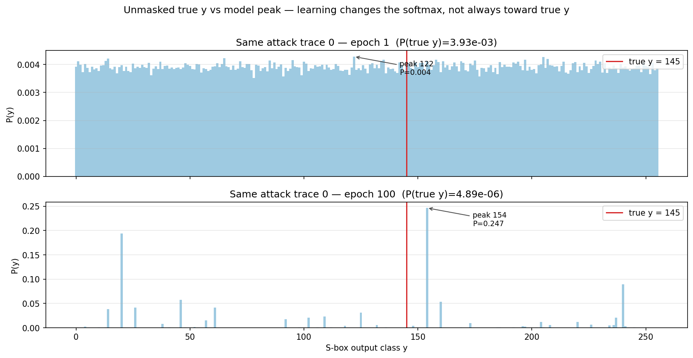
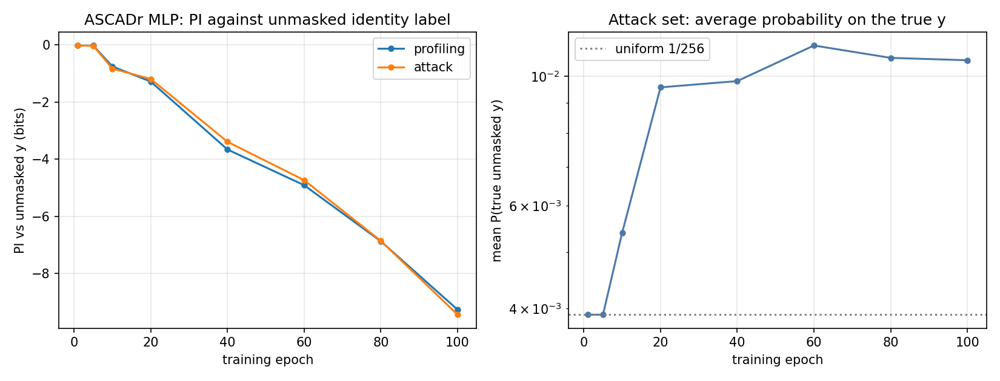

# What changes during learning

**Q:** From epoch 1 to epoch 100, what is the ASCADr MLP learning in its
outputs — and why can PI against the unmasked label *fall* while something
real is still being learned?

---

## Claim

Each checkpoint is a different network. **Learning** means the map

```text
power trace → softmax over y ∈ {0,…,255}
```

changes across epochs. On masked ASCADr that change is easy to misread if you
only watch PI against the **unmasked** label `y = Sbox[p ⊕ k]`.

## Example 1 — the same attack trace, epoch 1 vs epoch 100

Attack trace 0; true unmasked label `y = 145` (red line).



| | Epoch 1 | Epoch 100 |
|---|---:|---:|
| Shape of softmax | almost flat (~1/256) | sharp peaks |
| Peak class | 122 (P ≈ 0.004) | **154** (P ≈ 0.25) |
| P(true y = 145) | 3.9×10⁻³ | **4.9×10⁻⁶** |

**What this shows:** training did not leave the outputs alone. The model
became *confident* — but on this trace the confidence landed on the wrong
unmasked class, and the true unmasked `y` got *less* probability than at
epoch 1.

That is the concrete picture behind “PI can fall”: for some traces, mass
moves **away** from the unmasked truth.

## Example 2 — averages over the whole attack set



Selected epochs (attack set):

| Epoch | PI vs unmasked y (bits) | Mean P(true unmasked y) |
|---:|---:|---:|
| 1 | −0.02 | 0.00390 (= 1/256) |
| 5 | −0.02 | 0.00390 |
| 10 | −0.83 | 0.00540 |
| 20 | −1.19 | 0.00957 |
| 40 | −3.39 | 0.00981 |
| 60 | −4.73 | 0.01129 |
| 80 | −6.86 | 0.01076 |
| 100 | **−9.44** | **0.01065** |

Two facts at once:

1. **PI falls** (left panel) — the log-score against unmasked `y` gets worse
   on average (logs punish traces where P(true y) is tiny, as in Example 1).
2. **Mean P(true y) rises above chance** (right panel) — from 1/256 ≈ 0.0039
   to about 0.011 (~2.7× uniform). A weak average preference for the true
   unmasked class *does* appear; it is just not a sharp, reliable peak on
   every trace.

So “PI ↓” is not the same sentence as “the model never prefers the true y.”
It is “when we score with log-probability against unmasked y, the score
worsens,” while a mild average lift above uniform can still exist.


## Collected facts

| Evidence | Says | Hypothesis (not proven here) |
|---|---|---|
| Softmax epoch 1 → 100 on one trace | Outputs change from flat to peaky | Training acquires *some* structure in the outputs |
| Peak ≠ true unmasked y on that trace | Learning ≠ “always name unmasked y” | Peaks may track a **masked** intermediate, not plain `y` |
| Mean P(true y) > 1/256 late in training | A weak average signal toward unmasked y exists | Enough bias remains for multi-trace ranking to work |
| PI goes from ~0 to about **−9 bits** | On average, `log P(true unmasked y)` gets worse | We may be scoring the wrong target (unmasked `y`) for what the net learned |

**Not measured here:** which intermediate the peaks actually track, or in
which layer. That is Act III.

← Previous: [How many traces](how_many_traces.md) · [Index](README.md) · Next: [Chapter 8 — Perceived Information](08_perceived_information.md) →
