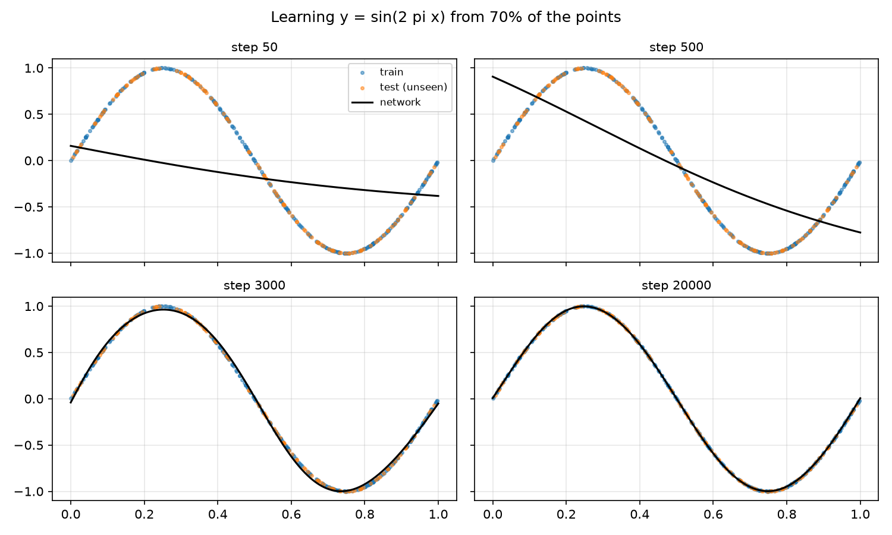
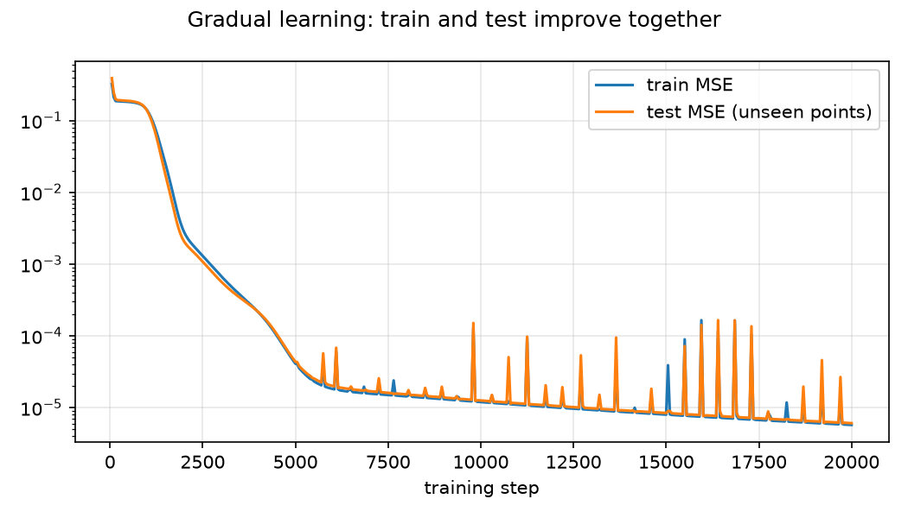
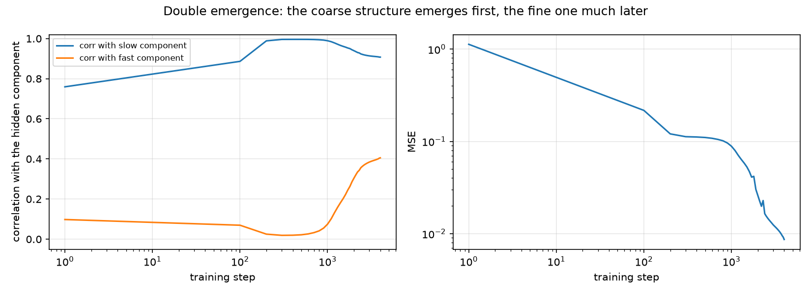
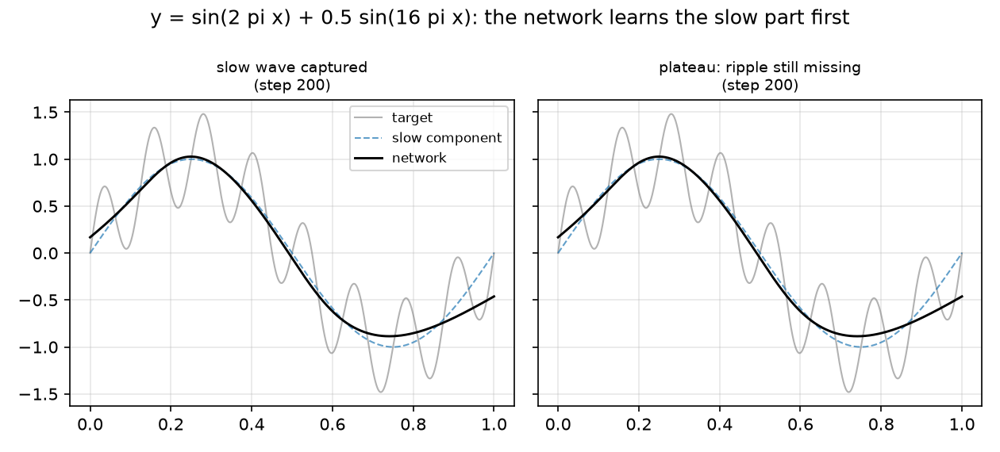

# Interlude — Watching features emerge in a toy network

> DRAFT — lives outside the repository until every number and figure is
> final. Pending: best-run numbers and figures from experiments B/C/D
> (drafts/emergence_lab/results/). Placement planned: after Chapter 6,
> before the attack chapter.

[Chapter 6](../feature_emergence/docs/06_training_and_checkpoints.md) showed
*that* training sets the weights, epoch by epoch, and that we keep a
checkpoint of every epoch. What it did not show is what learning *looks
like* from the inside: when does a network go from memorizing its training
data to actually finding structure?

That question is the heart of this study. The paper we follow notes that
learning from masked side-channel data resembles *grokking* — a phenomenon
first described in toy models that learn mathematical operations: the model
memorizes for a long time, showing no sign of progress on unseen data, and
then generalizes suddenly, as if a feature had snapped into place. The
paper's contribution is to catch that moment in real side-channel models.

Before doing that on power traces, we watch the same phenomenon in the
smallest possible laboratory: toy networks learning mathematical functions,
trained from scratch on a laptop in minutes. Every figure in this chapter
comes from a short numpy script — no TensorFlow, no GPU, nothing hidden.

## Part A — Learning a smooth function: the gradual case

The first task is the classic one: learn `y = sin(2πx)` from 400 scattered
points. To make generalization *visible*, the network only trains on 70% of
the points; the other 30% are held out and never shown.

The network is the smallest one that can do the job: one hidden layer of 16
neurons (`tanh`), one linear output — the same multiply–add–bend machinery
as [Chapter 5](../feature_emergence/docs/05_the_network.md), a few hundred
adjustable numbers in total.

At step 50 the network is nearly a straight line. At step 500 it has found
the overall downward trend. By step 3,000 it hugs the curve, and by step
20,000 the fit is exact — including over the orange points it never saw.
Learning here is *gradual*: train and test error fall together, smoothly.

What happened inside? Each hidden neuron computes `tanh(w·x + b)` — a soft
step whose transition sits at position `−b/w`. At initialization the
transitions are scattered at random; after training they tile the interval
at distinct positions, and the output layer adds them up with the right
signs to trace the sine.

This is the first honest meaning of *feature emergence*: nobody placed
those steps; gradient descent slid each one to where it reduces the error.
But there was no surprise here — progress was visible from the first steps.
The interesting case is when progress is invisible for a long time.

## Part B — Learning a rule: plateau, then a sudden jump

The second task looks even simpler: given two numbers `a` and `b` between 0
and 31, predict `(a + b) mod 32` — the remainder of the sum after wrapping
around, like clock arithmetic (27 + 9 = 36 → 4 on a 32-hour clock).

There are 1,024 possible pairs. The network sees each pair as two one-hot
vectors, passes through one hidden layer of 128 neurons, and outputs a
softmax over 32 classes. We train on half of the pairs and keep the other
half unseen. We also add *weight decay*: a tiny shrink applied to every
weight at every step, which penalizes complicated, memorizing solutions.

The curve has three acts:

1. **Memorization.** Within a few thousand steps, training accuracy hits
   100%. Test accuracy stays at chance (1/32 ≈ 3%). The network is a lookup
   table.
2. **The plateau.** For tens of thousands of steps, nothing seems to
   happen. Test accuracy does not move. An observer watching only test
   performance would conclude the model is stuck.
3. **The jump.** Then, within a fraction of the training time, test
   accuracy climbs past 90%. The network has found the general rule —
   circular structure in how the numbers combine — and weight decay has
   made that solution cheaper than the lookup table.

The same story told by **Perceived Information** — the metric of
[Chapter 8](../feature_emergence/docs/08_perceived_information.md), computed
here with exactly the same formula: PI sits near zero (or below) during the
plateau and jumps to ≈4.5 bits out of a maximum of 5 (log2 of 32 classes)
when generalization happens. PI sees the boom at the moment the outputs
become informative about the label, not before.

And inside the network? Projecting the hidden activations of the unseen
pairs onto their first two principal components, colored by the true
remainder:

During the plateau the classes are a shapeless cloud. After the jump they
arrange into an organized structure — the network has built an internal
representation where the remainder of `a + b` is encoded geometrically.
That arrangement *is* the emerged feature.

> NUMBERS TO REFRESH when the round-2 sweep finishes: crossing steps, final
> accuracies, and the choice of best run (currently seed 0, decay 0.3:
> plateau to ~step 28k, final test accuracy 92%, PI 4.5 bits).

## Part C — Two booms in one network: coarse first, fine later

[DRAFT — pending final results of experiments C and D]

The paper's most intriguing observation on CHES_CTF is that emergence came
in *two* jumps: first the network separated coarse structure (high vs low
Hamming weight), and only later fine structure (even vs odd). Can a toy
network show the same double emergence? Two honest ways to try:

**Variant 1 — one label, several readings.** Learn `(a + b) mod 16` and
measure PI against three coarsenings of the *same* label: parity (mod 2),
quarters (mod 4), and the full value (mod 16). If the network organizes
coarse structure first, the coarse PI curve jumps earlier than the fine one
— two booms, one network, nothing staged.

**Variant 2 — a sum of two functions.** Learn
`y = sin(2πx) + 0.5·sin(16πx)` — a slow wave plus a fast ripple. Networks
exhibit *spectral bias*: they fit low frequencies before high ones. We
measure the correlation of the output with each hidden component
separately, per training step. If the two correlations cross 0.9 at very
different times, that is the double boom in regression form.

> RESULTS PENDING: keep whichever variant separates cleanly in time; report
> the other honestly in one sentence.

## What the toy teaches, and what it does not

Three lessons transfer directly to the real chapters:

- **Learning can be invisible for a long time.** A model can look finished
  (100% training accuracy) and be worthless — or look stuck (chance-level
  test accuracy) and be one step away from generalizing. Only a metric
  watched *per epoch* can tell which.
- **Emergence is the appearance of structure, not a gradual improvement.**
  In the toy we can see the structure appear (PCA panels). On real traces
  we will have to hunt for it — that hunt is Act III.
- **This is why we saved every epoch.** The checkpoints of
  [Chapter 6](../feature_emergence/docs/06_training_and_checkpoints.md)
  exist precisely so that the jump, if there is one, is caught on camera.

And one honest limit: the toy has no *side channel* and no key to rank, so
guessing entropy — the metric of
[Chapter 7](../feature_emergence/docs/07_scoring_the_attack.md) — has no
honest analog here. GE enters when the secret is a real byte inside a real
chip. The bridge between the two worlds is PI: it is defined on any
classifier's outputs, toy or real, and it is the metric that will mark
*when* the real models cross their own jumps.

← Previous: [Chapter 6 — Training and checkpoints](../feature_emergence/docs/06_training_and_checkpoints.md) · [Index](../feature_emergence/docs/README.md) · Next: [Chapter 7 — Scoring the attack](../feature_emergence/docs/07_scoring_the_attack.md) →
